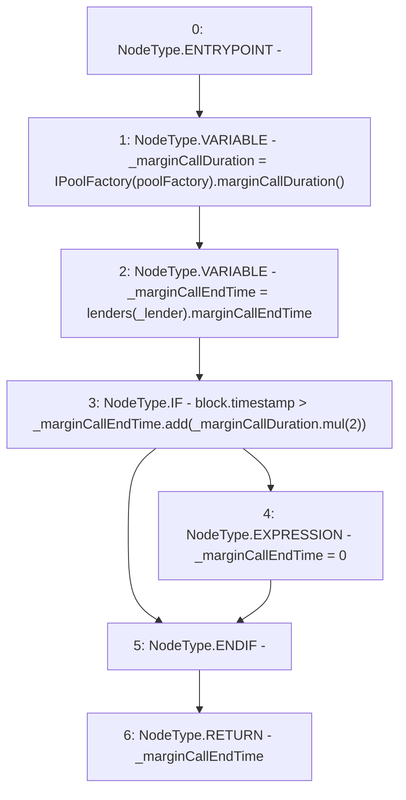

# Context: Pool.getMarginCallEndTime

**Contract:** `Pool` (Inherits: ReentrancyGuard, IPool, ERC20PausableUpgradeable, PausableUpgradeable, ERC20Upgradeable, IERC20Upgradeable, ContextUpgradeable, Initializable)
**Signature:** `getMarginCallEndTime(address) returns (uint256)`
**Method Selector ID:** `0x7320fc29`
**Visibility:** `public`
**Environment-Free:** `No (reads EVM state context)`
**Modifiers:** None

### State Variables Interaction
- **Reads:** lenders, poolFactory
- **Writes:** None

### Environment & Verification Flags
- **Uses Foundry Cheatcodes:** No
- **Has Echidna Properties:** No

### Internal Calls Tree
- None

### External Calls / Value Transfers
- `SafeMathUpgradeable.TMP_1921(uint256) = LIBRARY_CALL, dest:SafeMathUpgradeable, function:SafeMathUpgradeable.mul(uint256,uint256), arguments:['_marginCallDuration', '2'] `
- `IPoolFactory.TMP_1920(uint256) = HIGH_LEVEL_CALL, dest:TMP_1919(IPoolFactory), function:marginCallDuration, arguments:[]  `
- `SafeMathUpgradeable.TMP_1922(uint256) = LIBRARY_CALL, dest:SafeMathUpgradeable, function:SafeMathUpgradeable.add(uint256,uint256), arguments:['_marginCallEndTime', 'TMP_1921'] `

### Control Flow Graph (CFG)


### Source Mapping
Declared in: `contracts/Pool/Pool.sol` on lines **981** to **989**

```solidity
    function getMarginCallEndTime(address _lender) public view override returns (uint256) {
        uint256 _marginCallDuration = IPoolFactory(poolFactory).marginCallDuration();
        uint256 _marginCallEndTime = lenders[_lender].marginCallEndTime;

        if (block.timestamp > _marginCallEndTime.add(_marginCallDuration.mul(2))) {
            _marginCallEndTime = 0;
        }
        return _marginCallEndTime;
    }

```
