# Context: Pool.initialize

**Contract:** `Pool` (Inherits: ReentrancyGuard, IPool, ERC20PausableUpgradeable, PausableUpgradeable, ERC20Upgradeable, IERC20Upgradeable, ContextUpgradeable, Initializable)
**Signature:** `initialize(uint256,uint256,address,address,address,uint256,uint256,uint256,address,uint256,bool,address,uint256,uint256)`
**Method Selector ID:** `0x23932e04`
**Visibility:** `external`
**Environment-Free:** `No (reads EVM state context)`
**Modifiers:**
- `initializer`
  ```solidity
  modifier initializer() {
          require(_initializing || _isConstructor() || !_initialized, "Initializable: contract is already initialized");
  
          bool isTopLevelCall = !_initializing;
          if (isTopLevelCall) {
              _initializing = true;
              _initialized = true;
          }
  
          _;
  
          if (isTopLevelCall) {
              _initializing = false;
          }
      }
  ```

### State Variables Interaction
- **Reads:** poolConstants
- **Writes:** poolConstants, poolFactory

### Environment & Verification Flags
- **Uses Foundry Cheatcodes:** No
- **Has Echidna Properties:** No

### Internal Calls Tree
- None

### External Calls / Value Transfers
- `SafeMathUpgradeable.TMP_1502(uint256) = LIBRARY_CALL, dest:SafeMathUpgradeable, function:SafeMathUpgradeable.add(uint256,uint256), arguments:['block.timestamp', '_collectionPeriod'] `
- `SafeMathUpgradeable.TMP_1504(uint256) = LIBRARY_CALL, dest:SafeMathUpgradeable, function:SafeMathUpgradeable.add(uint256,uint256), arguments:['TMP_1503', '_loanWithdrawalDuration'] `
- `SafeMathUpgradeable.TMP_1503(uint256) = LIBRARY_CALL, dest:SafeMathUpgradeable, function:SafeMathUpgradeable.add(uint256,uint256), arguments:['block.timestamp', '_collectionPeriod'] `
- `ERC20Upgradeable.TMP_1507(uint8) = HIGH_LEVEL_CALL, dest:TMP_1506(ERC20Upgradeable), function:decimals, arguments:[]  `

### Control Flow Graph (CFG)

```mermaid
flowchart TD
    Node_0["0: NodeType.ENTRYPOINT - "]
    Node_0 --> Node_20
    Node_1["1: NodeType.EXPRESSION - poolFactory = msg.sender"]
    Node_1 --> Node_2
    Node_2["2: NodeType.EXPRESSION - poolConstants.borrowAsset = _borrowAsset"]
    Node_2 --> Node_3
    Node_3["3: NodeType.EXPRESSION - poolConstants.idealCollateralRatio = _idealCollateralRatio"]
    Node_3 --> Node_4
    Node_4["4: NodeType.EXPRESSION - poolConstants.collateralAsset = _collateralAsset"]
    Node_4 --> Node_5
    Node_5["5: NodeType.EXPRESSION - poolConstants.poolSavingsStrategy = _poolSavingsStrategy"]
    Node_5 --> Node_6
    Node_6["6: NodeType.EXPRESSION - poolConstants.borrowAmountRequested = _borrowAmountRequested"]
    Node_6 --> Node_7
    Node_7["7: NodeType.EXPRESSION - _initialDeposit(_borrower,_collateralAmount,_transferFromSavingsAccount)"]
    Node_7 --> Node_8
    Node_8["8: NodeType.EXPRESSION - poolConstants.borrower = _borrower"]
    Node_8 --> Node_9
    Node_9["9: NodeType.EXPRESSION - poolConstants.borrowRate = _borrowRate"]
    Node_9 --> Node_10
    Node_10["10: NodeType.EXPRESSION - poolConstants.noOfRepaymentIntervals = _noOfRepaymentIntervals"]
    Node_10 --> Node_11
    Node_11["11: NodeType.EXPRESSION - poolConstants.repaymentInterval = _repaymentInterval"]
    Node_11 --> Node_12
    Node_12["12: NodeType.EXPRESSION - poolConstants.lenderVerifier = _lenderVerifier"]
    Node_12 --> Node_13
    Node_13["13: NodeType.EXPRESSION - poolConstants.loanStartTime = block.timestamp.add(_collectionPeriod)"]
    Node_13 --> Node_14
    Node_14["14: NodeType.EXPRESSION - poolConstants.loanWithdrawalDeadline = block.timestamp.add(_collectionPeriod).add(_loanWithdrawalDuration)"]
    Node_14 --> Node_15
    Node_15["15: NodeType.EXPRESSION - __ERC20_init(Pool Tokens,PT)"]
    Node_15 --> Node_16
    Node_16["16: NodeType.TRY - _decimals = ERC20Upgradeable(_borrowAsset).decimals()"]
    Node_16 --> Node_17
    Node_16 --> Node_19
    Node_17["17: NodeType.CATCH - "]
    Node_17 --> Node_18
    Node_18["18: NodeType.EXPRESSION - _setupDecimals(_decimals)"]
    Node_19["19: NodeType.CATCH - "]
    Node_20["20: NodeType.EXPRESSION - initializer()"]
    Node_20 --> Node_1
```


### Source Mapping
Declared in: `contracts/Pool/Pool.sol` on lines **133** to **168**

```solidity
    function initialize(
        uint256 _borrowAmountRequested,
        uint256 _borrowRate,
        address _borrower,
        address _borrowAsset,
        address _collateralAsset,
        uint256 _idealCollateralRatio,
        uint256 _repaymentInterval,
        uint256 _noOfRepaymentIntervals,
        address _poolSavingsStrategy,
        uint256 _collateralAmount,
        bool _transferFromSavingsAccount,
        address _lenderVerifier,
        uint256 _loanWithdrawalDuration,
        uint256 _collectionPeriod
    ) external payable initializer {
        poolFactory = msg.sender;
        poolConstants.borrowAsset = _borrowAsset;
        poolConstants.idealCollateralRatio = _idealCollateralRatio;
        poolConstants.collateralAsset = _collateralAsset;
        poolConstants.poolSavingsStrategy = _poolSavingsStrategy;
        poolConstants.borrowAmountRequested = _borrowAmountRequested;
        _initialDeposit(_borrower, _collateralAmount, _transferFromSavingsAccount);
        poolConstants.borrower = _borrower;
        poolConstants.borrowRate = _borrowRate;
        poolConstants.noOfRepaymentIntervals = _noOfRepaymentIntervals;
        poolConstants.repaymentInterval = _repaymentInterval;
        poolConstants.lenderVerifier = _lenderVerifier;

        poolConstants.loanStartTime = block.timestamp.add(_collectionPeriod);
        poolConstants.loanWithdrawalDeadline = block.timestamp.add(_collectionPeriod).add(_loanWithdrawalDuration);
        __ERC20_init('Pool Tokens', 'PT');
        try ERC20Upgradeable(_borrowAsset).decimals() returns(uint8 _decimals) {
            _setupDecimals(_decimals);
        } catch(bytes memory) {}
    }

```
