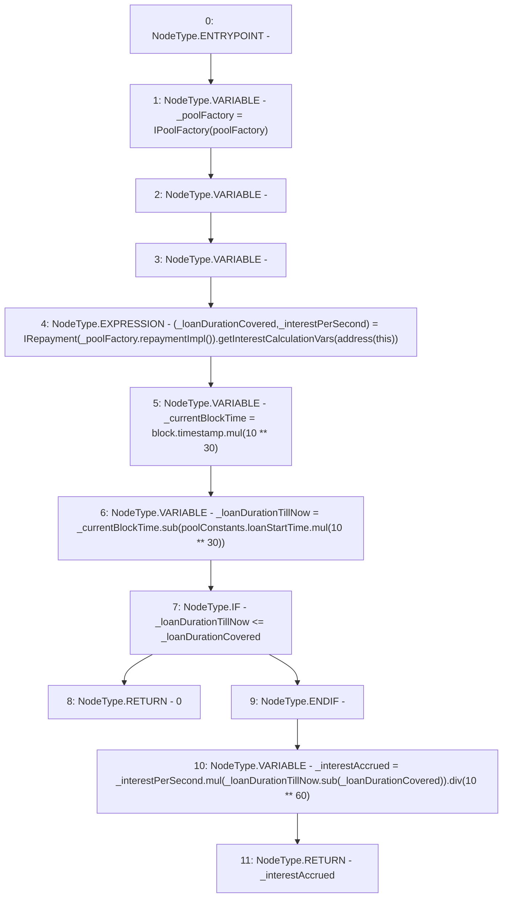

# Context: Pool.interestToPay

**Contract:** `Pool` (Inherits: ReentrancyGuard, IPool, ERC20PausableUpgradeable, PausableUpgradeable, ERC20Upgradeable, IERC20Upgradeable, ContextUpgradeable, Initializable)
**Signature:** `interestToPay() returns (uint256)`
**Method Selector ID:** `0x5695d52d`
**Visibility:** `public`
**Environment-Free:** `No (reads EVM state context)`
**Modifiers:** None

### State Variables Interaction
- **Reads:** poolConstants, poolFactory
- **Writes:** None

### Environment & Verification Flags
- **Uses Foundry Cheatcodes:** No
- **Has Echidna Properties:** No

### Internal Calls Tree
- None

### External Calls / Value Transfers
- `SafeMathUpgradeable.TMP_1797(uint256) = LIBRARY_CALL, dest:SafeMathUpgradeable, function:SafeMathUpgradeable.mul(uint256,uint256), arguments:['REF_777', 'TMP_1796'] `
- `IRepayment.TUPLE_17(uint256,uint256) = HIGH_LEVEL_CALL, dest:TMP_1792(IRepayment), function:getInterestCalculationVars, arguments:['TMP_1793']  `
- `SafeMathUpgradeable.TMP_1801(uint256) = LIBRARY_CALL, dest:SafeMathUpgradeable, function:SafeMathUpgradeable.mul(uint256,uint256), arguments:['_interestPerSecond', 'TMP_1800'] `
- `IPoolFactory.TMP_1791(address) = HIGH_LEVEL_CALL, dest:_poolFactory(IPoolFactory), function:repaymentImpl, arguments:[]  `
- `SafeMathUpgradeable.TMP_1803(uint256) = LIBRARY_CALL, dest:SafeMathUpgradeable, function:SafeMathUpgradeable.div(uint256,uint256), arguments:['TMP_1801', 'TMP_1802'] `
- `SafeMathUpgradeable.TMP_1800(uint256) = LIBRARY_CALL, dest:SafeMathUpgradeable, function:SafeMathUpgradeable.sub(uint256,uint256), arguments:['_loanDurationTillNow', '_loanDurationCovered'] `
- `SafeMathUpgradeable.TMP_1795(uint256) = LIBRARY_CALL, dest:SafeMathUpgradeable, function:SafeMathUpgradeable.mul(uint256,uint256), arguments:['block.timestamp', 'TMP_1794'] `
- `SafeMathUpgradeable.TMP_1798(uint256) = LIBRARY_CALL, dest:SafeMathUpgradeable, function:SafeMathUpgradeable.sub(uint256,uint256), arguments:['_currentBlockTime', 'TMP_1797'] `

### Control Flow Graph (CFG)


### Source Mapping
Declared in: `contracts/Pool/Pool.sol` on lines **672** to **685**

```solidity
    function interestToPay() public view returns (uint256) {
        IPoolFactory _poolFactory = IPoolFactory(poolFactory);
        (uint256 _loanDurationCovered, uint256 _interestPerSecond) = IRepayment(_poolFactory.repaymentImpl()).getInterestCalculationVars(
            address(this)
        );
        uint256 _currentBlockTime = block.timestamp.mul(10**30);
        uint256 _loanDurationTillNow = _currentBlockTime.sub(poolConstants.loanStartTime.mul(10**30));
        if (_loanDurationTillNow <= _loanDurationCovered) {
            return 0;
        }
        uint256 _interestAccrued = _interestPerSecond.mul(_loanDurationTillNow.sub(_loanDurationCovered)).div(10**60);

        return _interestAccrued;
    }

```
