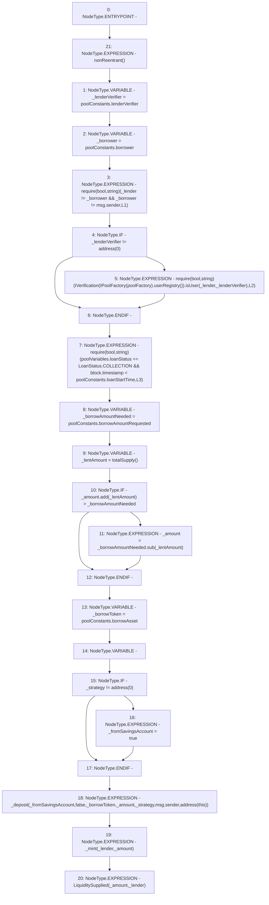

# Context: Pool.lend

**Contract:** `Pool` (Inherits: ReentrancyGuard, IPool, ERC20PausableUpgradeable, PausableUpgradeable, ERC20Upgradeable, IERC20Upgradeable, ContextUpgradeable, Initializable)
**Signature:** `lend(address,uint256,address)`
**Method Selector ID:** `0x7b1c4432`
**Visibility:** `external`
**Environment-Free:** `No (reads EVM state context)`
**Modifiers:**
- `nonReentrant`
  ```solidity
  modifier nonReentrant() {
          // On the first call to nonReentrant, _notEntered will be true
          require(_status != _ENTERED, "ReentrancyGuard: reentrant call");
  
          // Any calls to nonReentrant after this point will fail
          _status = _ENTERED;
  
          _;
  
          // By storing the original value once again, a refund is triggered (see
          // https://eips.ethereum.org/EIPS/eip-2200)
          _status = _NOT_ENTERED;
      }
  ```

### State Variables Interaction
- **Reads:** poolConstants, poolFactory, poolVariables
- **Writes:** None

### Assertion Checks & Business Requirements
- require/assert: `require(bool,string)(_lender != _borrower && _borrower != msg.sender,L1)`
- require/assert: `require(bool,string)(IVerification(IPoolFactory(poolFactory).userRegistry()).isUser(_lender,_lenderVerifier),L2)`
- require/assert: `require(bool,string)(poolVariables.loanStatus == LoanStatus.COLLECTION && block.timestamp < poolConstants.loanStartTime,L3)`

### Environment & Verification Flags
- **Uses Foundry Cheatcodes:** No
- **Has Echidna Properties:** No

### Internal Calls Tree
- None

### External Calls / Value Transfers
- `IVerification.TMP_1609(bool) = HIGH_LEVEL_CALL, dest:TMP_1608(IVerification), function:isUser, arguments:['_lender', '_lenderVerifier']  `
- `SafeMathUpgradeable.TMP_1616(uint256) = LIBRARY_CALL, dest:SafeMathUpgradeable, function:SafeMathUpgradeable.add(uint256,uint256), arguments:['_amount', '_lentAmount'] `
- `SafeMathUpgradeable.TMP_1618(uint256) = LIBRARY_CALL, dest:SafeMathUpgradeable, function:SafeMathUpgradeable.sub(uint256,uint256), arguments:['_borrowAmountNeeded', '_lentAmount'] `
- `IPoolFactory.TMP_1607(address) = HIGH_LEVEL_CALL, dest:TMP_1606(IPoolFactory), function:userRegistry, arguments:[]  `

### Control Flow Graph (CFG)


### Source Mapping
Declared in: `contracts/Pool/Pool.sol` on lines **390** to **424**

```solidity
    function lend(
        address _lender,
        uint256 _amount,
        address _strategy
    ) external payable nonReentrant {
        address _lenderVerifier = poolConstants.lenderVerifier;
        address _borrower = poolConstants.borrower;
        require(_lender != _borrower && _borrower != msg.sender, 'L1');
        if (_lenderVerifier != address(0)) {
            require(IVerification(IPoolFactory(poolFactory).userRegistry()).isUser(_lender, _lenderVerifier), 'L2');
        }
        require(poolVariables.loanStatus == LoanStatus.COLLECTION && block.timestamp < poolConstants.loanStartTime, 'L3');
        uint256 _borrowAmountNeeded = poolConstants.borrowAmountRequested;
        uint256 _lentAmount = totalSupply();
        if (_amount.add(_lentAmount) > _borrowAmountNeeded) {
            _amount = _borrowAmountNeeded.sub(_lentAmount);
        }

        address _borrowToken = poolConstants.borrowAsset;
        bool _fromSavingsAccount;
        if(_strategy != address(0)) {
            _fromSavingsAccount = true;
        }
        _deposit(
            _fromSavingsAccount,
            false,
            _borrowToken,
            _amount,
            _strategy,
            msg.sender,
            address(this)
        );
        _mint(_lender, _amount);
        emit LiquiditySupplied(_amount, _lender);
    }

```
