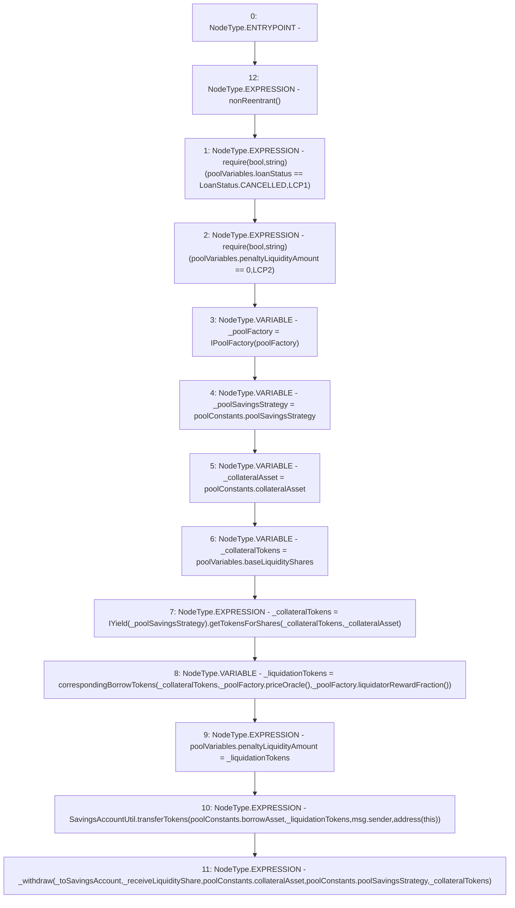

# Context: Pool.liquidateCancelPenalty

**Contract:** `Pool` (Inherits: ReentrancyGuard, IPool, ERC20PausableUpgradeable, PausableUpgradeable, ERC20Upgradeable, IERC20Upgradeable, ContextUpgradeable, Initializable)
**Signature:** `liquidateCancelPenalty(bool,bool)`
**Method Selector ID:** `0xc94db32c`
**Visibility:** `external`
**Environment-Free:** `No (reads EVM state context)`
**Modifiers:**
- `nonReentrant`
  ```solidity
  modifier nonReentrant() {
          // On the first call to nonReentrant, _notEntered will be true
          require(_status != _ENTERED, "ReentrancyGuard: reentrant call");
  
          // Any calls to nonReentrant after this point will fail
          _status = _ENTERED;
  
          _;
  
          // By storing the original value once again, a refund is triggered (see
          // https://eips.ethereum.org/EIPS/eip-2200)
          _status = _NOT_ENTERED;
      }
  ```

### State Variables Interaction
- **Reads:** poolConstants, poolFactory, poolVariables
- **Writes:** poolVariables

### Assertion Checks & Business Requirements
- require/assert: `require(bool,string)(poolVariables.loanStatus == LoanStatus.CANCELLED,LCP1)`
- require/assert: `require(bool,string)(poolVariables.penaltyLiquidityAmount == 0,LCP2)`

### Environment & Verification Flags
- **Uses Foundry Cheatcodes:** No
- **Has Echidna Properties:** No

### Internal Calls Tree
- None

### External Calls / Value Transfers
- `IYield.TMP_1715(uint256) = HIGH_LEVEL_CALL, dest:TMP_1714(IYield), function:getTokensForShares, arguments:['_collateralTokens', '_collateralAsset']  `
- `SavingsAccountUtil.TMP_1720(uint256) = LIBRARY_CALL, dest:SavingsAccountUtil, function:SavingsAccountUtil.transferTokens(address,uint256,address,address), arguments:['REF_732', '_liquidationTokens', 'msg.sender', 'TMP_1719'] `
- `IPoolFactory.TMP_1717(uint256) = HIGH_LEVEL_CALL, dest:_poolFactory(IPoolFactory), function:liquidatorRewardFraction, arguments:[]  `
- `IPoolFactory.TMP_1716(address) = HIGH_LEVEL_CALL, dest:_poolFactory(IPoolFactory), function:priceOracle, arguments:[]  `

### Control Flow Graph (CFG)


### Source Mapping
Declared in: `contracts/Pool/Pool.sol` on lines **550** to **574**

```solidity
    function liquidateCancelPenalty(bool _toSavingsAccount, bool _receiveLiquidityShare) external nonReentrant {
        require(poolVariables.loanStatus == LoanStatus.CANCELLED, 'LCP1');
        require(poolVariables.penaltyLiquidityAmount == 0, 'LCP2');
        IPoolFactory _poolFactory = IPoolFactory(poolFactory);
        address _poolSavingsStrategy = poolConstants.poolSavingsStrategy;
        address _collateralAsset = poolConstants.collateralAsset;
        // note: extra liquidity shares are not applicable as the loan never reaches active state
        uint256 _collateralTokens = poolVariables.baseLiquidityShares;
        _collateralTokens = IYield(_poolSavingsStrategy).getTokensForShares(_collateralTokens, _collateralAsset);

        uint256 _liquidationTokens = correspondingBorrowTokens(
            _collateralTokens,
            _poolFactory.priceOracle(),
            _poolFactory.liquidatorRewardFraction()
        );
        poolVariables.penaltyLiquidityAmount = _liquidationTokens;
        SavingsAccountUtil.transferTokens(poolConstants.borrowAsset, _liquidationTokens, msg.sender, address(this));
        _withdraw(
            _toSavingsAccount,
            _receiveLiquidityShare,
            poolConstants.collateralAsset,
            poolConstants.poolSavingsStrategy,
            _collateralTokens
        );
    }

```
