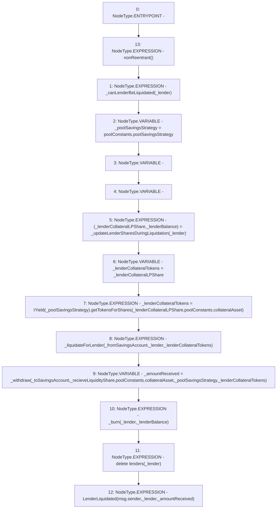

# Context: Pool.liquidateForLender

**Contract:** `Pool` (Inherits: ReentrancyGuard, IPool, ERC20PausableUpgradeable, PausableUpgradeable, ERC20Upgradeable, IERC20Upgradeable, ContextUpgradeable, Initializable)
**Signature:** `liquidateForLender(address,bool,bool,bool)`
**Method Selector ID:** `0xbde5ef32`
**Visibility:** `external`
**Environment-Free:** `No (reads EVM state context)`
**Modifiers:**
- `nonReentrant`
  ```solidity
  modifier nonReentrant() {
          // On the first call to nonReentrant, _notEntered will be true
          require(_status != _ENTERED, "ReentrancyGuard: reentrant call");
  
          // Any calls to nonReentrant after this point will fail
          _status = _ENTERED;
  
          _;
  
          // By storing the original value once again, a refund is triggered (see
          // https://eips.ethereum.org/EIPS/eip-2200)
          _status = _NOT_ENTERED;
      }
  ```

### State Variables Interaction
- **Reads:** lenders, poolConstants
- **Writes:** lenders

### Environment & Verification Flags
- **Uses Foundry Cheatcodes:** No
- **Has Echidna Properties:** No

### Internal Calls Tree
- None

### External Calls / Value Transfers
- `IYield.TMP_1879(uint256) = HIGH_LEVEL_CALL, dest:TMP_1878(IYield), function:getTokensForShares, arguments:['_lenderCollateralLPShare', 'REF_843']  `

### Control Flow Graph (CFG)


### Source Mapping
Declared in: `contracts/Pool/Pool.sol` on lines **864** to **890**

```solidity
    function liquidateForLender(
        address _lender,
        bool _fromSavingsAccount,
        bool _toSavingsAccount,
        bool _recieveLiquidityShare
    ) external payable nonReentrant {
        _canLenderBeLiquidated(_lender);

        address _poolSavingsStrategy = poolConstants.poolSavingsStrategy;
        (uint256 _lenderCollateralLPShare, uint256 _lenderBalance) = _updateLenderSharesDuringLiquidation(_lender);

        uint256 _lenderCollateralTokens = _lenderCollateralLPShare;
        _lenderCollateralTokens = IYield(_poolSavingsStrategy).getTokensForShares(_lenderCollateralLPShare, poolConstants.collateralAsset);

        _liquidateForLender(_fromSavingsAccount, _lender, _lenderCollateralTokens);

        uint256 _amountReceived = _withdraw(
            _toSavingsAccount,
            _recieveLiquidityShare,
            poolConstants.collateralAsset,
            _poolSavingsStrategy,
            _lenderCollateralTokens
        );
        _burn(_lender, _lenderBalance);
        delete lenders[_lender];
        emit LenderLiquidated(msg.sender, _lender, _amountReceived);
    }

```
