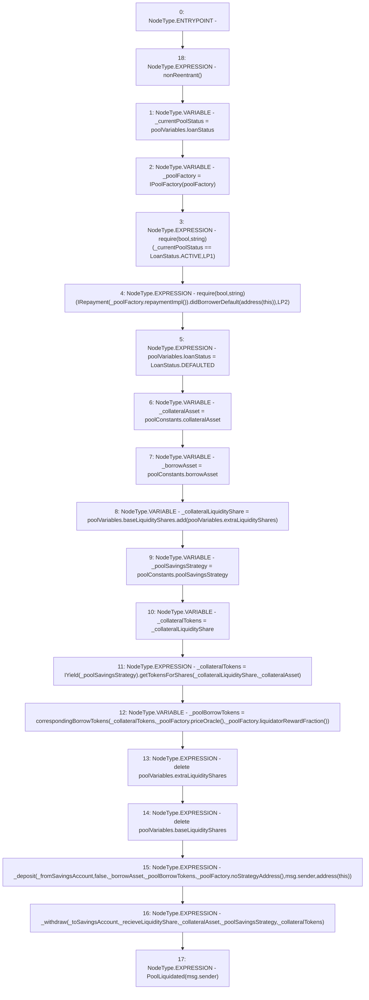

# Context: Pool.liquidatePool

**Contract:** `Pool` (Inherits: ReentrancyGuard, IPool, ERC20PausableUpgradeable, PausableUpgradeable, ERC20Upgradeable, IERC20Upgradeable, ContextUpgradeable, Initializable)
**Signature:** `liquidatePool(bool,bool,bool)`
**Method Selector ID:** `0x7729886f`
**Visibility:** `external`
**Environment-Free:** `No (reads EVM state context)`
**Modifiers:**
- `nonReentrant`
  ```solidity
  modifier nonReentrant() {
          // On the first call to nonReentrant, _notEntered will be true
          require(_status != _ENTERED, "ReentrancyGuard: reentrant call");
  
          // Any calls to nonReentrant after this point will fail
          _status = _ENTERED;
  
          _;
  
          // By storing the original value once again, a refund is triggered (see
          // https://eips.ethereum.org/EIPS/eip-2200)
          _status = _NOT_ENTERED;
      }
  ```

### State Variables Interaction
- **Reads:** poolConstants, poolFactory, poolVariables
- **Writes:** poolVariables

### Assertion Checks & Business Requirements
- require/assert: `require(bool,string)(_currentPoolStatus == LoanStatus.ACTIVE,LP1)`
- require/assert: `require(bool,string)(IRepayment(_poolFactory.repaymentImpl()).didBorrowerDefault(address(this)),LP2)`

### Environment & Verification Flags
- **Uses Foundry Cheatcodes:** No
- **Has Echidna Properties:** No

### Internal Calls Tree
- None

### External Calls / Value Transfers
- `IRepayment.TMP_1830(bool) = HIGH_LEVEL_CALL, dest:TMP_1828(IRepayment), function:didBorrowerDefault, arguments:['TMP_1829']  `
- `IPoolFactory.TMP_1827(address) = HIGH_LEVEL_CALL, dest:_poolFactory(IPoolFactory), function:repaymentImpl, arguments:[]  `
- `SafeMathUpgradeable.TMP_1832(uint256) = LIBRARY_CALL, dest:SafeMathUpgradeable, function:SafeMathUpgradeable.add(uint256,uint256), arguments:['REF_808', 'REF_810'] `
- `IYield.TMP_1834(uint256) = HIGH_LEVEL_CALL, dest:TMP_1833(IYield), function:getTokensForShares, arguments:['_collateralLiquidityShare', '_collateralAsset']  `
- `IPoolFactory.TMP_1835(address) = HIGH_LEVEL_CALL, dest:_poolFactory(IPoolFactory), function:priceOracle, arguments:[]  `
- `IPoolFactory.TMP_1838(address) = HIGH_LEVEL_CALL, dest:_poolFactory(IPoolFactory), function:noStrategyAddress, arguments:[]  `
- `IPoolFactory.TMP_1836(uint256) = HIGH_LEVEL_CALL, dest:_poolFactory(IPoolFactory), function:liquidatorRewardFraction, arguments:[]  `

### Control Flow Graph (CFG)


### Source Mapping
Declared in: `contracts/Pool/Pool.sol` on lines **735** to **765**

```solidity
    function liquidatePool(
        bool _fromSavingsAccount,
        bool _toSavingsAccount,
        bool _recieveLiquidityShare
    ) external payable nonReentrant {
        LoanStatus _currentPoolStatus = poolVariables.loanStatus;
        IPoolFactory _poolFactory = IPoolFactory(poolFactory);
        require(_currentPoolStatus == LoanStatus.ACTIVE, 'LP1');
        require(IRepayment(_poolFactory.repaymentImpl()).didBorrowerDefault(address(this)), 'LP2');
        poolVariables.loanStatus = LoanStatus.DEFAULTED;

        address _collateralAsset = poolConstants.collateralAsset;
        address _borrowAsset = poolConstants.borrowAsset;
        uint256 _collateralLiquidityShare = poolVariables.baseLiquidityShares.add(poolVariables.extraLiquidityShares);
        address _poolSavingsStrategy = poolConstants.poolSavingsStrategy;

        uint256 _collateralTokens = _collateralLiquidityShare;
        _collateralTokens = IYield(_poolSavingsStrategy).getTokensForShares(_collateralLiquidityShare, _collateralAsset);

        uint256 _poolBorrowTokens = correspondingBorrowTokens(
            _collateralTokens,
            _poolFactory.priceOracle(),
            _poolFactory.liquidatorRewardFraction()
        );
        delete poolVariables.extraLiquidityShares;
        delete poolVariables.baseLiquidityShares;

        _deposit(_fromSavingsAccount, false, _borrowAsset, _poolBorrowTokens, _poolFactory.noStrategyAddress(), msg.sender, address(this));
        _withdraw(_toSavingsAccount, _recieveLiquidityShare, _collateralAsset, _poolSavingsStrategy, _collateralTokens);
        emit PoolLiquidated(msg.sender);
    }

```
