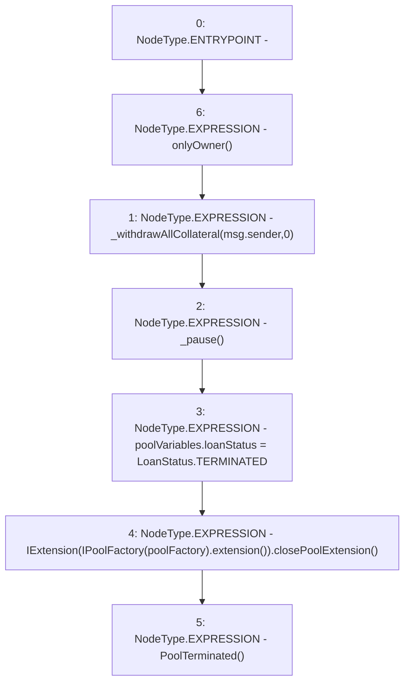

# Context: Pool.terminatePool

**Contract:** `Pool` (Inherits: ReentrancyGuard, IPool, ERC20PausableUpgradeable, PausableUpgradeable, ERC20Upgradeable, IERC20Upgradeable, ContextUpgradeable, Initializable)
**Signature:** `terminatePool()`
**Method Selector ID:** `0x45571276`
**Visibility:** `external`
**Environment-Free:** `No (reads EVM state context)`
**Modifiers:**
- `onlyOwner`
  ```solidity
  modifier onlyOwner() {
          require(msg.sender == IPoolFactory(poolFactory).owner(), 'OO1');
          _;
      }
  ```

### State Variables Interaction
- **Reads:** poolFactory, poolVariables
- **Writes:** poolVariables

### Environment & Verification Flags
- **Uses Foundry Cheatcodes:** No
- **Has Echidna Properties:** No

### Internal Calls Tree
- None

### External Calls / Value Transfers
- `IExtension.HIGH_LEVEL_CALL, dest:TMP_1727(IExtension), function:closePoolExtension, arguments:[]  `
- `IPoolFactory.TMP_1726(address) = HIGH_LEVEL_CALL, dest:TMP_1725(IPoolFactory), function:extension, arguments:[]  `

### Control Flow Graph (CFG)


### Source Mapping
Declared in: `contracts/Pool/Pool.sol` on lines **580** to **586**

```solidity
    function terminatePool() external onlyOwner {
        _withdrawAllCollateral(msg.sender, 0);
        _pause();
        poolVariables.loanStatus = LoanStatus.TERMINATED;
        IExtension(IPoolFactory(poolFactory).extension()).closePoolExtension();
        emit PoolTerminated();
    }

```
