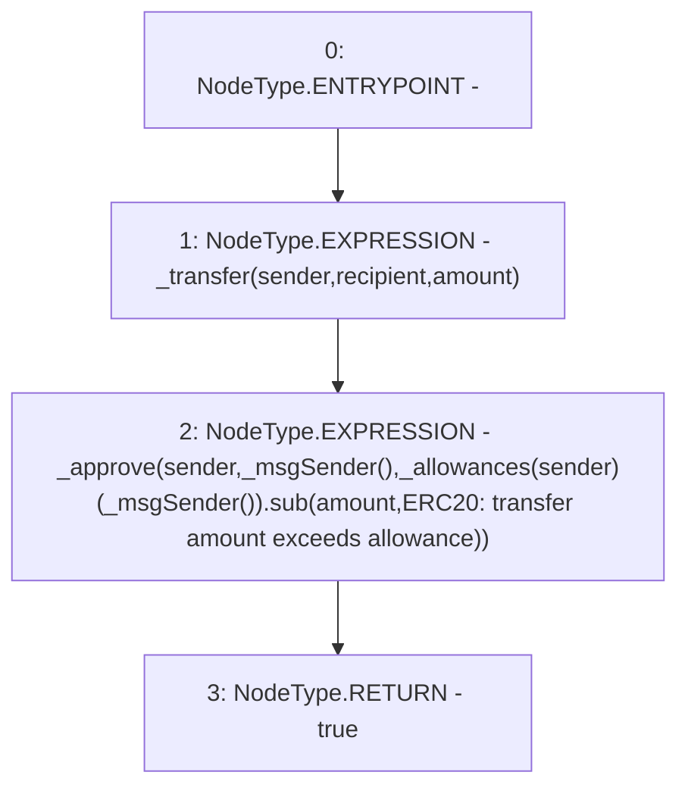

# Context: Pool.transferFrom

**Contract:** `Pool` (Inherits: ReentrancyGuard, IPool, ERC20PausableUpgradeable, PausableUpgradeable, ERC20Upgradeable, IERC20Upgradeable, ContextUpgradeable, Initializable)
**Signature:** `transferFrom(address,address,uint256) returns (bool)`
**Method Selector ID:** `0x23b872dd`
**Visibility:** `public`
**Environment-Free:** `No (reads EVM state context)`
**Modifiers:** None

### State Variables Interaction
- **Reads:** _allowances
- **Writes:** None

### Environment & Verification Flags
- **Uses Foundry Cheatcodes:** No
- **Has Echidna Properties:** No

### Internal Calls Tree
- None

### External Calls / Value Transfers
- `SafeMathUpgradeable.TMP_1456(uint256) = LIBRARY_CALL, dest:SafeMathUpgradeable, function:SafeMathUpgradeable.sub(uint256,uint256,string), arguments:['REF_542', 'amount', 'ERC20: transfer amount exceeds allowance'] `

### Control Flow Graph (CFG)


### Source Mapping
Declared in: `node_modules/@openzeppelin/contracts-upgradeable/token/ERC20/ERC20Upgradeable.sol` on lines **158** to **162**

```solidity
    function transferFrom(address sender, address recipient, uint256 amount) public virtual override returns (bool) {
        _transfer(sender, recipient, amount);
        _approve(sender, _msgSender(), _allowances[sender][_msgSender()].sub(amount, "ERC20: transfer amount exceeds allowance"));
        return true;
    }

```
