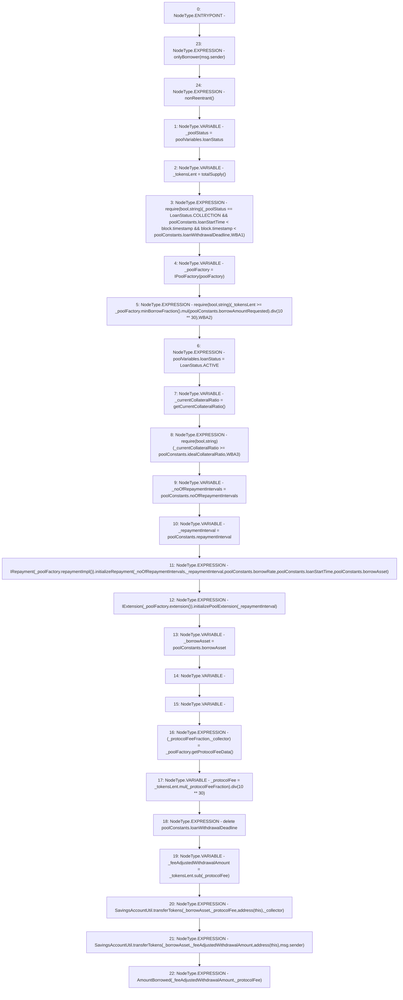

# Context: Pool.withdrawBorrowedAmount

**Contract:** `Pool` (Inherits: ReentrancyGuard, IPool, ERC20PausableUpgradeable, PausableUpgradeable, ERC20Upgradeable, IERC20Upgradeable, ContextUpgradeable, Initializable)
**Signature:** `withdrawBorrowedAmount()`
**Method Selector ID:** `0x95f3f456`
**Visibility:** `external`
**Environment-Free:** `No (reads EVM state context)`
**Modifiers:**
- `onlyBorrower`
  ```solidity
  modifier onlyBorrower(address _user) {
          require(_user == poolConstants.borrower, 'OB1');
          _;
      }
  ```
- `nonReentrant`
  ```solidity
  modifier nonReentrant() {
          // On the first call to nonReentrant, _notEntered will be true
          require(_status != _ENTERED, "ReentrancyGuard: reentrant call");
  
          // Any calls to nonReentrant after this point will fail
          _status = _ENTERED;
  
          _;
  
          // By storing the original value once again, a refund is triggered (see
          // https://eips.ethereum.org/EIPS/eip-2200)
          _status = _NOT_ENTERED;
      }
  ```

### State Variables Interaction
- **Reads:** poolConstants, poolFactory, poolVariables
- **Writes:** poolConstants, poolVariables

### Assertion Checks & Business Requirements
- require/assert: `require(bool,string)(_poolStatus == LoanStatus.COLLECTION && poolConstants.loanStartTime < block.timestamp && block.timestamp < poolConstants.loanWithdrawalDeadline,WBA1)`
- require/assert: `require(bool,string)(_tokensLent >= _poolFactory.minBorrowFraction().mul(poolConstants.borrowAmountRequested).div(10 ** 30),WBA2)`
- require/assert: `require(bool,string)(_currentCollateralRatio >= poolConstants.idealCollateralRatio,WBA3)`

### Environment & Verification Flags
- **Uses Foundry Cheatcodes:** No
- **Has Echidna Properties:** No

### Internal Calls Tree
- None

### External Calls / Value Transfers
- `IRepayment.HIGH_LEVEL_CALL, dest:TMP_1571(IRepayment), function:initializeRepayment, arguments:['_noOfRepaymentIntervals', '_repaymentInterval', 'REF_627', 'REF_628', 'REF_629']  `
- `IPoolFactory.TUPLE_16(uint256,address) = HIGH_LEVEL_CALL, dest:_poolFactory(IPoolFactory), function:getProtocolFeeData, arguments:[]  `
- `IPoolFactory.TMP_1573(address) = HIGH_LEVEL_CALL, dest:_poolFactory(IPoolFactory), function:extension, arguments:[]  `
- `IExtension.HIGH_LEVEL_CALL, dest:TMP_1574(IExtension), function:initializePoolExtension, arguments:['_repaymentInterval']  `
- `SavingsAccountUtil.TMP_1583(uint256) = LIBRARY_CALL, dest:SavingsAccountUtil, function:SavingsAccountUtil.transferTokens(address,uint256,address,address), arguments:['_borrowAsset', '_feeAdjustedWithdrawalAmount', 'TMP_1582', 'msg.sender'] `
- `SafeMathUpgradeable.TMP_1564(uint256) = LIBRARY_CALL, dest:SafeMathUpgradeable, function:SafeMathUpgradeable.div(uint256,uint256), arguments:['TMP_1562', 'TMP_1563'] `
- `SafeMathUpgradeable.TMP_1578(uint256) = LIBRARY_CALL, dest:SafeMathUpgradeable, function:SafeMathUpgradeable.div(uint256,uint256), arguments:['TMP_1576', 'TMP_1577'] `
- `SavingsAccountUtil.TMP_1581(uint256) = LIBRARY_CALL, dest:SavingsAccountUtil, function:SavingsAccountUtil.transferTokens(address,uint256,address,address), arguments:['_borrowAsset', '_protocolFee', 'TMP_1580', '_collector'] `
- `SafeMathUpgradeable.TMP_1562(uint256) = LIBRARY_CALL, dest:SafeMathUpgradeable, function:SafeMathUpgradeable.mul(uint256,uint256), arguments:['TMP_1561', 'REF_618'] `
- `IPoolFactory.TMP_1561(uint256) = HIGH_LEVEL_CALL, dest:_poolFactory(IPoolFactory), function:minBorrowFraction, arguments:[]  `
- `IPoolFactory.TMP_1570(address) = HIGH_LEVEL_CALL, dest:_poolFactory(IPoolFactory), function:repaymentImpl, arguments:[]  `
- `SafeMathUpgradeable.TMP_1576(uint256) = LIBRARY_CALL, dest:SafeMathUpgradeable, function:SafeMathUpgradeable.mul(uint256,uint256), arguments:['_tokensLent', '_protocolFeeFraction'] `
- `SafeMathUpgradeable.TMP_1579(uint256) = LIBRARY_CALL, dest:SafeMathUpgradeable, function:SafeMathUpgradeable.sub(uint256,uint256), arguments:['_tokensLent', '_protocolFee'] `

### Control Flow Graph (CFG)


### Source Mapping
Declared in: `contracts/Pool/Pool.sol` on lines **310** to **348**

```solidity
    function withdrawBorrowedAmount() external override onlyBorrower(msg.sender) nonReentrant {
        LoanStatus _poolStatus = poolVariables.loanStatus;
        uint256 _tokensLent = totalSupply();
        require(
            _poolStatus == LoanStatus.COLLECTION &&
                poolConstants.loanStartTime < block.timestamp &&
                block.timestamp < poolConstants.loanWithdrawalDeadline,
            'WBA1'
        );
        IPoolFactory _poolFactory = IPoolFactory(poolFactory);
        require(_tokensLent >= _poolFactory.minBorrowFraction().mul(poolConstants.borrowAmountRequested).div(10**30), 'WBA2');

        poolVariables.loanStatus = LoanStatus.ACTIVE;
        uint256 _currentCollateralRatio = getCurrentCollateralRatio();
        require(_currentCollateralRatio >= poolConstants.idealCollateralRatio, 'WBA3');

        uint256 _noOfRepaymentIntervals = poolConstants.noOfRepaymentIntervals;
        uint256 _repaymentInterval = poolConstants.repaymentInterval;
        IRepayment(_poolFactory.repaymentImpl()).initializeRepayment(
            _noOfRepaymentIntervals,
            _repaymentInterval,
            poolConstants.borrowRate,
            poolConstants.loanStartTime,
            poolConstants.borrowAsset
        );
        IExtension(_poolFactory.extension()).initializePoolExtension(_repaymentInterval);

        address _borrowAsset = poolConstants.borrowAsset;
        (uint256 _protocolFeeFraction, address _collector) = _poolFactory.getProtocolFeeData();
        uint256 _protocolFee = _tokensLent.mul(_protocolFeeFraction).div(10**30);
        delete poolConstants.loanWithdrawalDeadline;

        uint256 _feeAdjustedWithdrawalAmount = _tokensLent.sub(_protocolFee);

        SavingsAccountUtil.transferTokens(_borrowAsset, _protocolFee, address(this), _collector);
        SavingsAccountUtil.transferTokens(_borrowAsset, _feeAdjustedWithdrawalAmount, address(this), msg.sender);

        emit AmountBorrowed(_feeAdjustedWithdrawalAmount, _protocolFee);
    }

```
