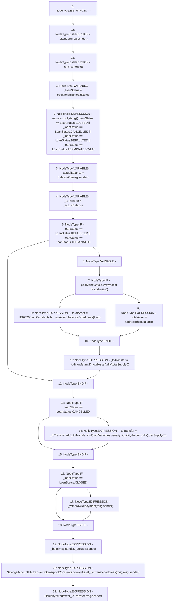

# Context: Pool.withdrawLiquidity

**Contract:** `Pool` (Inherits: ReentrancyGuard, IPool, ERC20PausableUpgradeable, PausableUpgradeable, ERC20Upgradeable, IERC20Upgradeable, ContextUpgradeable, Initializable)
**Signature:** `withdrawLiquidity()`
**Method Selector ID:** `0x7ea382c1`
**Visibility:** `external`
**Environment-Free:** `No (reads EVM state context)`
**Modifiers:**
- `isLender`
  ```solidity
  modifier isLender(address _lender) {
          require(balanceOf(_lender) != 0, 'IL1');
          _;
      }
  ```
- `nonReentrant`
  ```solidity
  modifier nonReentrant() {
          // On the first call to nonReentrant, _notEntered will be true
          require(_status != _ENTERED, "ReentrancyGuard: reentrant call");
  
          // Any calls to nonReentrant after this point will fail
          _status = _ENTERED;
  
          _;
  
          // By storing the original value once again, a refund is triggered (see
          // https://eips.ethereum.org/EIPS/eip-2200)
          _status = _NOT_ENTERED;
      }
  ```

### State Variables Interaction
- **Reads:** poolConstants, poolVariables
- **Writes:** None

### Assertion Checks & Business Requirements
- require/assert: `require(bool,string)(_loanStatus == LoanStatus.CLOSED || _loanStatus == LoanStatus.CANCELLED || _loanStatus == LoanStatus.DEFAULTED || _loanStatus == LoanStatus.TERMINATED,WL1)`

### Environment & Verification Flags
- **Uses Foundry Cheatcodes:** No
- **Has Echidna Properties:** No

### Internal Calls Tree
- None

### External Calls / Value Transfers
- `SavingsAccountUtil.TMP_1773(uint256) = LIBRARY_CALL, dest:SavingsAccountUtil, function:SavingsAccountUtil.transferTokens(address,uint256,address,address), arguments:['REF_765', '_toTransfer', 'TMP_1772', 'msg.sender'] `
- `SafeMathUpgradeable.TMP_1768(uint256) = LIBRARY_CALL, dest:SafeMathUpgradeable, function:SafeMathUpgradeable.add(uint256,uint256), arguments:['_toTransfer', 'TMP_1767'] `
- `SafeMathUpgradeable.TMP_1765(uint256) = LIBRARY_CALL, dest:SafeMathUpgradeable, function:SafeMathUpgradeable.mul(uint256,uint256), arguments:['_toTransfer', 'REF_761'] `
- `SafeMathUpgradeable.TMP_1763(uint256) = LIBRARY_CALL, dest:SafeMathUpgradeable, function:SafeMathUpgradeable.div(uint256,uint256), arguments:['TMP_1761', 'TMP_1762'] `
- `IERC20.TMP_1758(uint256) = HIGH_LEVEL_CALL, dest:TMP_1756(IERC20), function:balanceOf, arguments:['TMP_1757']  `
- `SafeMathUpgradeable.TMP_1767(uint256) = LIBRARY_CALL, dest:SafeMathUpgradeable, function:SafeMathUpgradeable.div(uint256,uint256), arguments:['TMP_1765', 'TMP_1766'] `
- `SafeMathUpgradeable.TMP_1761(uint256) = LIBRARY_CALL, dest:SafeMathUpgradeable, function:SafeMathUpgradeable.mul(uint256,uint256), arguments:['_toTransfer', '_totalAsset'] `

### Control Flow Graph (CFG)


### Source Mapping
Declared in: `contracts/Pool/Pool.sol` on lines **607** to **648**

```solidity
    function withdrawLiquidity() external isLender(msg.sender) nonReentrant {
        LoanStatus _loanStatus = poolVariables.loanStatus;

        require(
            _loanStatus == LoanStatus.CLOSED ||
                _loanStatus == LoanStatus.CANCELLED ||
                _loanStatus == LoanStatus.DEFAULTED ||
                _loanStatus == LoanStatus.TERMINATED,
            'WL1'
        );

        //gets amount through liquidity shares
        uint256 _actualBalance = balanceOf(msg.sender);
        uint256 _toTransfer = _actualBalance;

        if (_loanStatus == LoanStatus.DEFAULTED || _loanStatus == LoanStatus.TERMINATED) {
            uint256 _totalAsset;
            if (poolConstants.borrowAsset != address(0)) {
                _totalAsset = IERC20(poolConstants.borrowAsset).balanceOf(address(this));
            } else {
                _totalAsset = address(this).balance;
            }
            //assuming their will be no tokens in pool in any case except liquidation (to be checked) or we should store the amount in liquidate()
            _toTransfer = _toTransfer.mul(_totalAsset).div(totalSupply());
        }

        if (_loanStatus == LoanStatus.CANCELLED) {
            _toTransfer = _toTransfer.add(_toTransfer.mul(poolVariables.penaltyLiquidityAmount).div(totalSupply()));
        }

        if (_loanStatus == LoanStatus.CLOSED) {
            //transfer repayment
            _withdrawRepayment(msg.sender);
        }
        //to add transfer if not included in above (can be transferred with liquidity)
        _burn(msg.sender, _actualBalance);

        //transfer liquidity provided
        SavingsAccountUtil.transferTokens(poolConstants.borrowAsset, _toTransfer, address(this), msg.sender);

        emit LiquidityWithdrawn(_toTransfer, msg.sender);
    }

```
