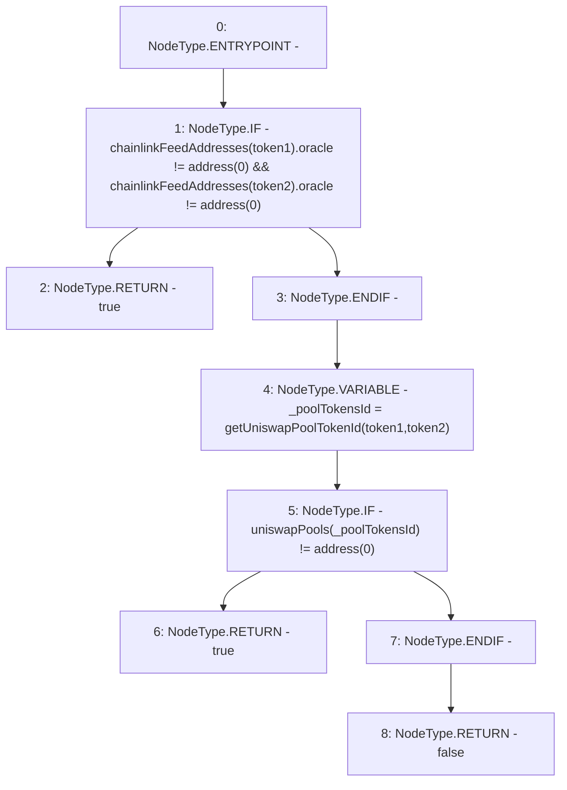

# Context: PriceOracle.doesFeedExist

**Contract:** `PriceOracle` (Inherits: IPriceOracle, OwnableUpgradeable, ContextUpgradeable, Initializable)
**Signature:** `doesFeedExist(address,address) returns (bool)`
**Method Selector ID:** `0x633defbd`
**Visibility:** `external`
**Environment-Free:** `Yes`
**Modifiers:** None

### State Variables Interaction
- **Reads:** chainlinkFeedAddresses, uniswapPools
- **Writes:** None

### Environment & Verification Flags
- **Uses Foundry Cheatcodes:** No
- **Has Echidna Properties:** No

### Internal Calls Tree
- None

### External Calls / Value Transfers
- None

### Control Flow Graph (CFG)


### Source Mapping
Declared in: `contracts/PriceOracle.sol` on lines **169** to **181**

```solidity
    function doesFeedExist(address token1, address token2) external view override returns (bool) {
        if (chainlinkFeedAddresses[token1].oracle != address(0) && chainlinkFeedAddresses[token2].oracle != address(0)) {
            return true;
        }

        bytes32 _poolTokensId = getUniswapPoolTokenId(token1, token2);

        if (uniswapPools[_poolTokensId] != address(0)) {
            return true;
        }

        return false;
    }

```
