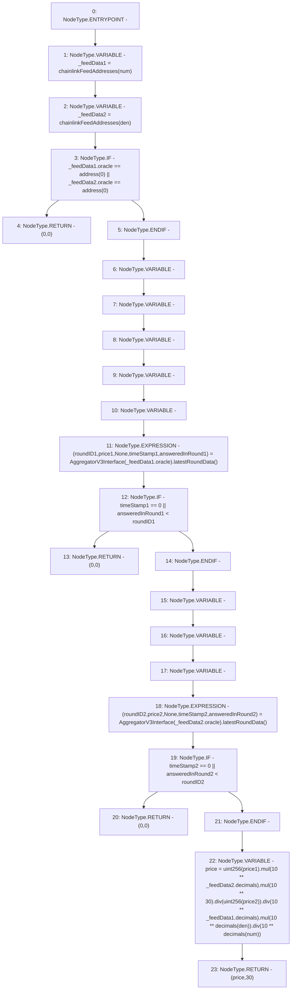

# Context: PriceOracle.getChainlinkLatestPrice

**Contract:** `PriceOracle` (Inherits: IPriceOracle, OwnableUpgradeable, ContextUpgradeable, Initializable)
**Signature:** `getChainlinkLatestPrice(address,address) returns (uint256, uint256)`
**Method Selector ID:** `0xf37eace8`
**Visibility:** `public`
**Environment-Free:** `Yes`
**Modifiers:** None

### State Variables Interaction
- **Reads:** chainlinkFeedAddresses, decimals
- **Writes:** None

### Environment & Verification Flags
- **Uses Foundry Cheatcodes:** No
- **Has Echidna Properties:** No

### Internal Calls Tree
- None

### External Calls / Value Transfers
- `AggregatorV3Interface.TUPLE_24(uint80,int256,uint256,uint256,uint80) = HIGH_LEVEL_CALL, dest:TMP_2381(AggregatorV3Interface), function:latestRoundData, arguments:[]  `
- `SafeMath.TMP_2391(uint256) = LIBRARY_CALL, dest:SafeMath, function:SafeMath.div(uint256,uint256), arguments:['TMP_2389', 'TMP_2390'] `
- `SafeMath.TMP_2389(uint256) = LIBRARY_CALL, dest:SafeMath, function:SafeMath.mul(uint256,uint256), arguments:['TMP_2387', 'TMP_2388'] `
- `SafeMath.TMP_2395(uint256) = LIBRARY_CALL, dest:SafeMath, function:SafeMath.mul(uint256,uint256), arguments:['TMP_2393', 'TMP_2394'] `
- `SafeMath.TMP_2397(uint256) = LIBRARY_CALL, dest:SafeMath, function:SafeMath.div(uint256,uint256), arguments:['TMP_2395', 'TMP_2396'] `
- `SafeMath.TMP_2393(uint256) = LIBRARY_CALL, dest:SafeMath, function:SafeMath.div(uint256,uint256), arguments:['TMP_2391', 'TMP_2392'] `
- `AggregatorV3Interface.TUPLE_23(uint80,int256,uint256,uint256,uint80) = HIGH_LEVEL_CALL, dest:TMP_2377(AggregatorV3Interface), function:latestRoundData, arguments:[]  `
- `SafeMath.TMP_2387(uint256) = LIBRARY_CALL, dest:SafeMath, function:SafeMath.mul(uint256,uint256), arguments:['TMP_2385', 'TMP_2386'] `

### Control Flow Graph (CFG)


### Source Mapping
Declared in: `contracts/PriceOracle.sol` on lines **48** to **94**

```solidity
    function getChainlinkLatestPrice(address num, address den) public view returns (uint256, uint256) {
        PriceData memory _feedData1 = chainlinkFeedAddresses[num];
        PriceData memory _feedData2 = chainlinkFeedAddresses[den];
        if (_feedData1.oracle == address(0) || _feedData2.oracle == address(0)) {
            return (0, 0);
        }
        int256 price1;
        int256 price2;
        {
            uint80 roundID1;
            uint256 timeStamp1;
            uint80 answeredInRound1;
            (
                roundID1,
                price1,
                ,
                timeStamp1,
                answeredInRound1
            ) = AggregatorV3Interface(_feedData1.oracle).latestRoundData();
            if(timeStamp1 == 0 || answeredInRound1 < roundID1) {
                return (0, 0);
            }
        }
        {
            uint80 roundID2;
            uint256 timeStamp2;
            uint80 answeredInRound2;
            (
                roundID2,
                price2,
                ,
                timeStamp2,
                answeredInRound2
            ) = AggregatorV3Interface(_feedData2.oracle).latestRoundData();
            if(timeStamp2 == 0 || answeredInRound2 < roundID2) {
                return (0, 0);
            }
        }
        uint256 price = uint256(price1)
            .mul(10**_feedData2.decimals)
            .mul(10**30)
            .div(uint256(price2))
            .div(10**_feedData1.decimals)
            .mul(10**decimals[den])
            .div(10**decimals[num]);
        return (price, 30);
    }

```
