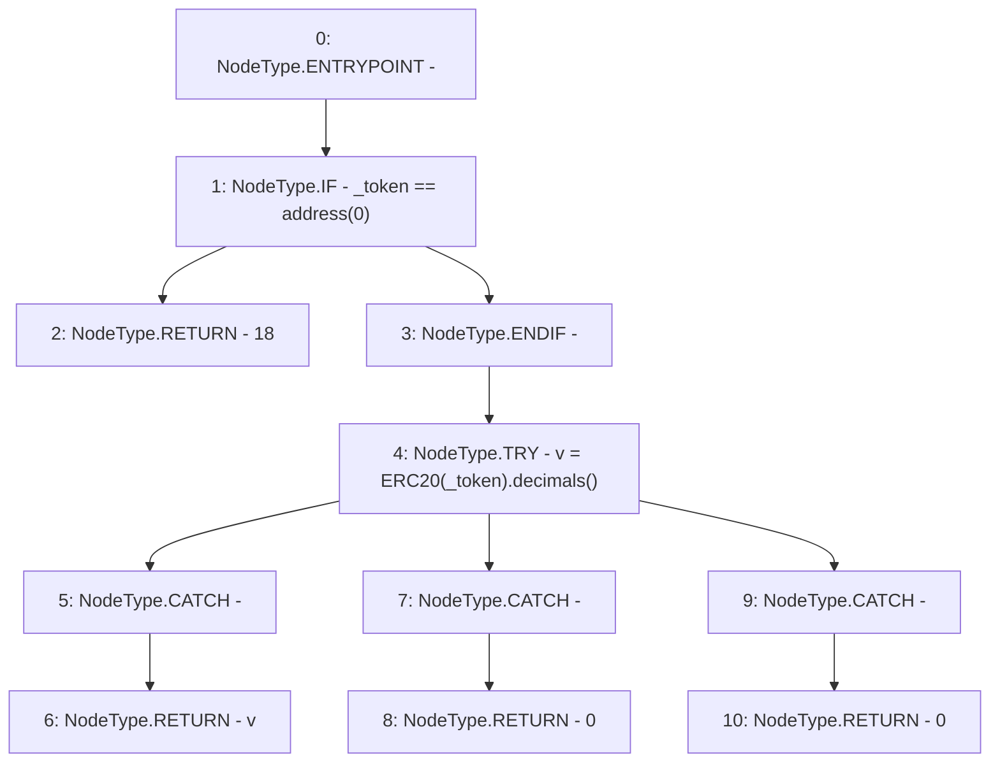

# Context: PriceOracle.getDecimals

**Contract:** `PriceOracle` (Inherits: IPriceOracle, OwnableUpgradeable, ContextUpgradeable, Initializable)
**Signature:** `getDecimals(address) returns (uint8)`
**Method Selector ID:** `Internal (No Method ID)`
**Visibility:** `internal`
**Environment-Free:** `Yes`
**Modifiers:** None

### State Variables Interaction
- **Reads:** None
- **Writes:** None

### Environment & Verification Flags
- **Uses Foundry Cheatcodes:** No
- **Has Echidna Properties:** No

### Internal Calls Tree
- None

### External Calls / Value Transfers
- `ERC20.TMP_2401(uint8) = HIGH_LEVEL_CALL, dest:TMP_2400(ERC20), function:decimals, arguments:[]  `

### Control Flow Graph (CFG)


### Source Mapping
Declared in: `contracts/PriceOracle.sol` on lines **101** to **113**

```solidity
    function getDecimals(address _token) internal view returns (uint8) {
        if (_token == address(0)) {
            return 18;
        }

        try ERC20(_token).decimals() returns (uint8 v) {
            return v;
        } catch Error(string memory) {
            return 0;
        } catch (bytes memory) {
            return 0;
        }
    }

```
