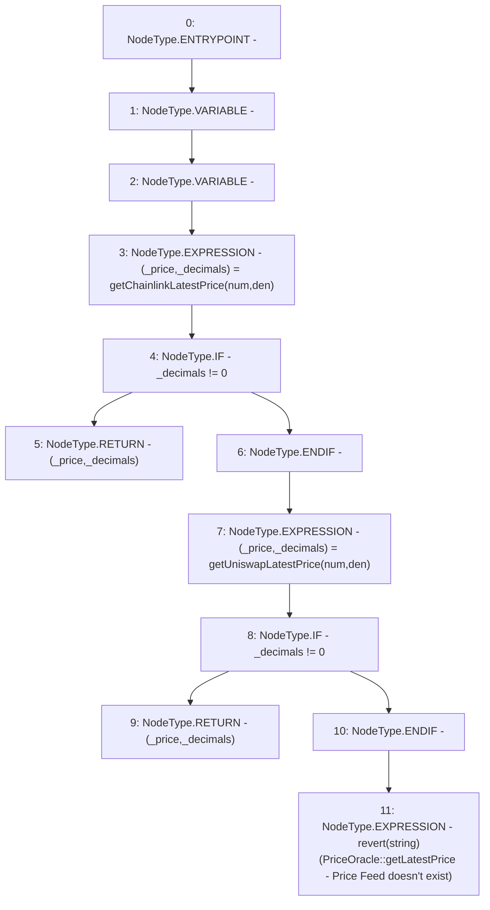

# Context: PriceOracle.getLatestPrice

**Contract:** `PriceOracle` (Inherits: IPriceOracle, OwnableUpgradeable, ContextUpgradeable, Initializable)
**Signature:** `getLatestPrice(address,address) returns (uint256, uint256)`
**Method Selector ID:** `0x10603c11`
**Visibility:** `external`
**Environment-Free:** `Yes`
**Modifiers:** None

### State Variables Interaction
- **Reads:** None
- **Writes:** None

### Assertion Checks & Business Requirements
- revert: `revert(string)(PriceOracle::getLatestPrice - Price Feed doesn't exist)`

### Environment & Verification Flags
- **Uses Foundry Cheatcodes:** No
- **Has Echidna Properties:** No

### Internal Calls Tree
- None

### External Calls / Value Transfers
- None

### Control Flow Graph (CFG)


### Source Mapping
Declared in: `contracts/PriceOracle.sol` on lines **149** to **161**

```solidity
    function getLatestPrice(address num, address den) external view override returns (uint256, uint256) {
        uint256 _price;
        uint256 _decimals;
        (_price, _decimals) = getChainlinkLatestPrice(num, den);
        if (_decimals != 0) {
            return (_price, _decimals);
        }
        (_price, _decimals) = getUniswapLatestPrice(num, den);
        if (_decimals != 0) {
            return (_price, _decimals);
        }
        revert("PriceOracle::getLatestPrice - Price Feed doesn't exist");
    }

```
