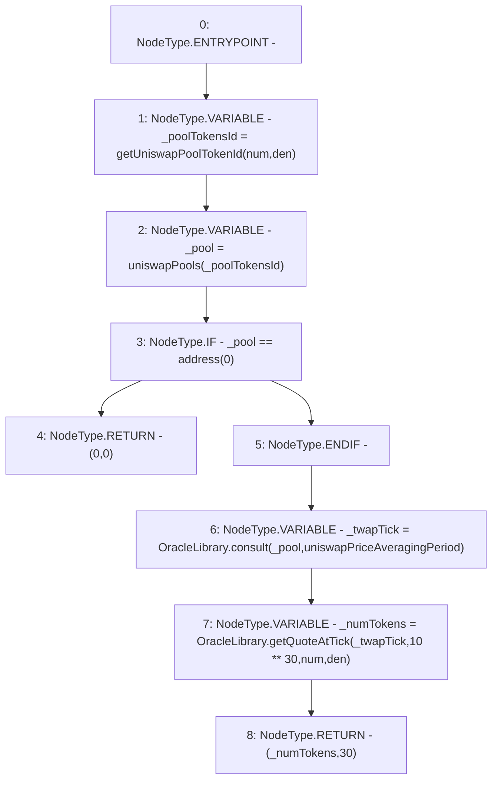

# Context: PriceOracle.getUniswapLatestPrice

**Contract:** `PriceOracle` (Inherits: IPriceOracle, OwnableUpgradeable, ContextUpgradeable, Initializable)
**Signature:** `getUniswapLatestPrice(address,address) returns (uint256, uint256)`
**Method Selector ID:** `0x8f8bb822`
**Visibility:** `public`
**Environment-Free:** `Yes`
**Modifiers:** None

### State Variables Interaction
- **Reads:** uniswapPools, uniswapPriceAveragingPeriod
- **Writes:** None

### Environment & Verification Flags
- **Uses Foundry Cheatcodes:** No
- **Has Echidna Properties:** No

### Internal Calls Tree
- None

### External Calls / Value Transfers
- `OracleLibrary.TMP_2407(uint256) = LIBRARY_CALL, dest:OracleLibrary, function:OracleLibrary.getQuoteAtTick(int24,uint128,address,address), arguments:['_twapTick', 'TMP_2406', 'num', 'den'] `
- `OracleLibrary.TMP_2405(int24) = LIBRARY_CALL, dest:OracleLibrary, function:OracleLibrary.consult(address,uint32), arguments:['_pool', 'uniswapPriceAveragingPeriod'] `

### Control Flow Graph (CFG)


### Source Mapping
Declared in: `contracts/PriceOracle.sol` on lines **122** to **132**

```solidity
    function getUniswapLatestPrice(address num, address den) public view returns (uint256, uint256) {
        bytes32 _poolTokensId = getUniswapPoolTokenId(num, den);
        address _pool = uniswapPools[_poolTokensId];
        if (_pool == address(0)) {
            return (0, 0);
        }

        int24 _twapTick = OracleLibrary.consult(_pool, uniswapPriceAveragingPeriod);
        uint256 _numTokens = OracleLibrary.getQuoteAtTick(_twapTick, 10**30, num, den);
        return (_numTokens, 30);
    }

```
