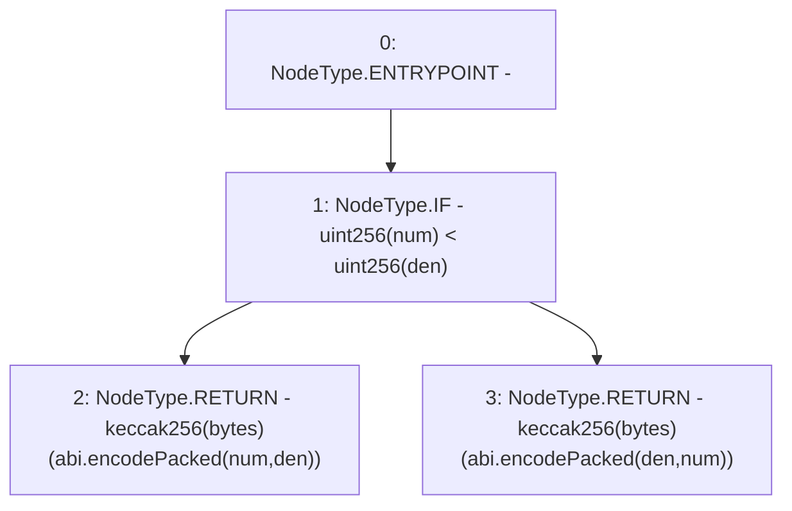

# Context: PriceOracle.getUniswapPoolTokenId

**Contract:** `PriceOracle` (Inherits: IPriceOracle, OwnableUpgradeable, ContextUpgradeable, Initializable)
**Signature:** `getUniswapPoolTokenId(address,address) returns (bytes32)`
**Method Selector ID:** `Internal (No Method ID)`
**Visibility:** `internal`
**Environment-Free:** `Yes`
**Modifiers:** None

### State Variables Interaction
- **Reads:** None
- **Writes:** None

### Environment & Verification Flags
- **Uses Foundry Cheatcodes:** No
- **Has Echidna Properties:** No

### Internal Calls Tree
- None

### External Calls / Value Transfers
- None

### Control Flow Graph (CFG)


### Source Mapping
Declared in: `contracts/PriceOracle.sol` on lines **134** to **140**

```solidity
    function getUniswapPoolTokenId(address num, address den) internal pure returns (bytes32) {
        if (uint256(num) < uint256(den)) {
            return keccak256(abi.encodePacked(num, den));
        } else {
            return keccak256(abi.encodePacked(den, num));
        }
    }

```
