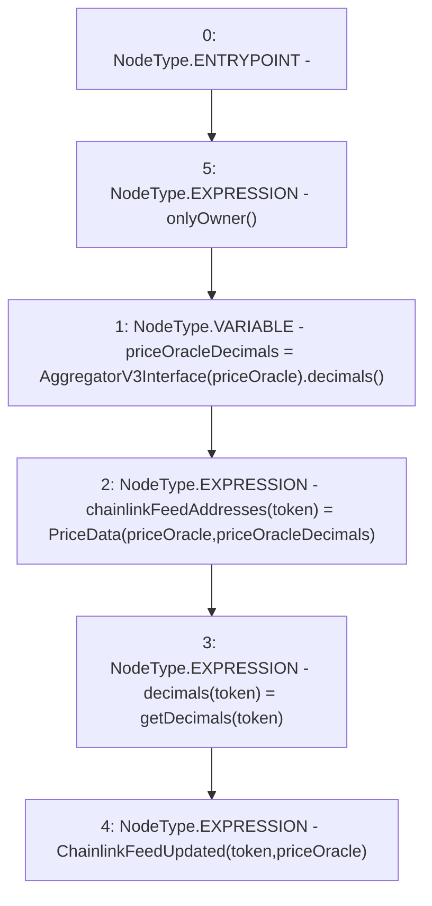

# Context: PriceOracle.setChainlinkFeedAddress

**Contract:** `PriceOracle` (Inherits: IPriceOracle, OwnableUpgradeable, ContextUpgradeable, Initializable)
**Signature:** `setChainlinkFeedAddress(address,address)`
**Method Selector ID:** `0xfa6fc430`
**Visibility:** `external`
**Environment-Free:** `No (reads EVM state context)`
**Modifiers:**
- `onlyOwner`
  ```solidity
  modifier onlyOwner() {
          require(owner() == _msgSender(), "Ownable: caller is not the owner");
          _;
      }
  ```

### State Variables Interaction
- **Reads:** None
- **Writes:** chainlinkFeedAddresses, decimals

### Environment & Verification Flags
- **Uses Foundry Cheatcodes:** No
- **Has Echidna Properties:** No

### Internal Calls Tree
- None

### External Calls / Value Transfers
- `AggregatorV3Interface.TMP_2427(uint8) = HIGH_LEVEL_CALL, dest:TMP_2426(AggregatorV3Interface), function:decimals, arguments:[]  `

### Control Flow Graph (CFG)


### Source Mapping
Declared in: `contracts/PriceOracle.sol` on lines **189** to **194**

```solidity
    function setChainlinkFeedAddress(address token, address priceOracle) external onlyOwner {
        uint256 priceOracleDecimals = AggregatorV3Interface(priceOracle).decimals();
        chainlinkFeedAddresses[token] = PriceData(priceOracle, priceOracleDecimals);
        decimals[token] = getDecimals(token);
        emit ChainlinkFeedUpdated(token, priceOracle);
    }

```
