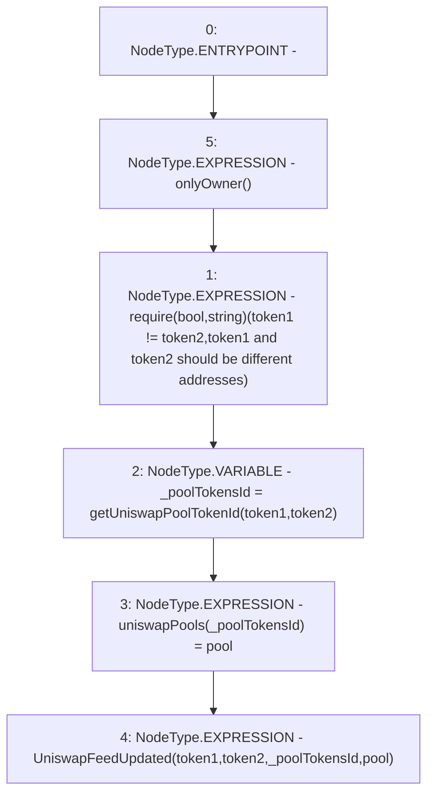

# Context: PriceOracle.setUniswapFeedAddress

**Contract:** `PriceOracle` (Inherits: IPriceOracle, OwnableUpgradeable, ContextUpgradeable, Initializable)
**Signature:** `setUniswapFeedAddress(address,address,address)`
**Method Selector ID:** `0x0626a92b`
**Visibility:** `external`
**Environment-Free:** `No (reads EVM state context)`
**Modifiers:**
- `onlyOwner`
  ```solidity
  modifier onlyOwner() {
          require(owner() == _msgSender(), "Ownable: caller is not the owner");
          _;
      }
  ```

### State Variables Interaction
- **Reads:** None
- **Writes:** uniswapPools

### Assertion Checks & Business Requirements
- require/assert: `require(bool,string)(token1 != token2,token1 and token2 should be different addresses)`

### Environment & Verification Flags
- **Uses Foundry Cheatcodes:** No
- **Has Echidna Properties:** No

### Internal Calls Tree
- None

### External Calls / Value Transfers
- None

### Control Flow Graph (CFG)


### Source Mapping
Declared in: `contracts/PriceOracle.sol` on lines **203** to **212**

```solidity
    function setUniswapFeedAddress(
        address token1,
        address token2,
        address pool
    ) external onlyOwner {
        require(token1 != token2, 'token1 and token2 should be different addresses');
        bytes32 _poolTokensId = getUniswapPoolTokenId(token1, token2);
        uniswapPools[_poolTokensId] = pool;
        emit UniswapFeedUpdated(token1, token2, _poolTokensId, pool);
    }

```
