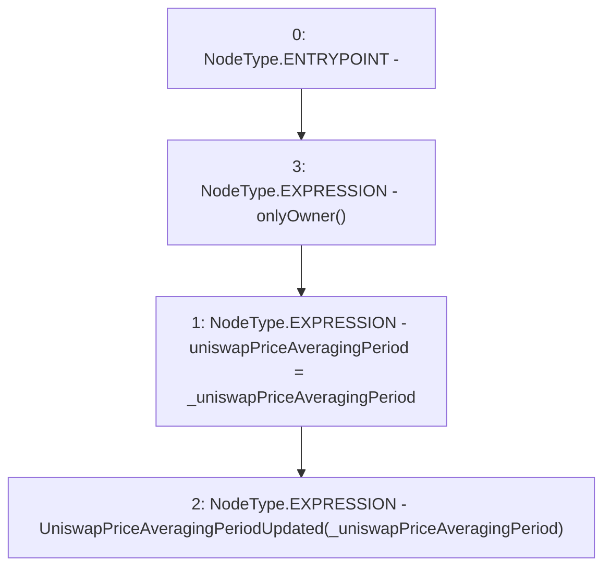

# Context: PriceOracle.setUniswapPriceAveragingPeriod

**Contract:** `PriceOracle` (Inherits: IPriceOracle, OwnableUpgradeable, ContextUpgradeable, Initializable)
**Signature:** `setUniswapPriceAveragingPeriod(uint32)`
**Method Selector ID:** `0x252a62c1`
**Visibility:** `external`
**Environment-Free:** `No (reads EVM state context)`
**Modifiers:**
- `onlyOwner`
  ```solidity
  modifier onlyOwner() {
          require(owner() == _msgSender(), "Ownable: caller is not the owner");
          _;
      }
  ```

### State Variables Interaction
- **Reads:** None
- **Writes:** uniswapPriceAveragingPeriod

### Environment & Verification Flags
- **Uses Foundry Cheatcodes:** No
- **Has Echidna Properties:** No

### Internal Calls Tree
- None

### External Calls / Value Transfers
- None

### Control Flow Graph (CFG)


### Source Mapping
Declared in: `contracts/PriceOracle.sol` on lines **219** to **222**

```solidity
    function setUniswapPriceAveragingPeriod(uint32 _uniswapPriceAveragingPeriod) external onlyOwner {
        uniswapPriceAveragingPeriod = _uniswapPriceAveragingPeriod;
        emit UniswapPriceAveragingPeriodUpdated(_uniswapPriceAveragingPeriod);
    }

```
