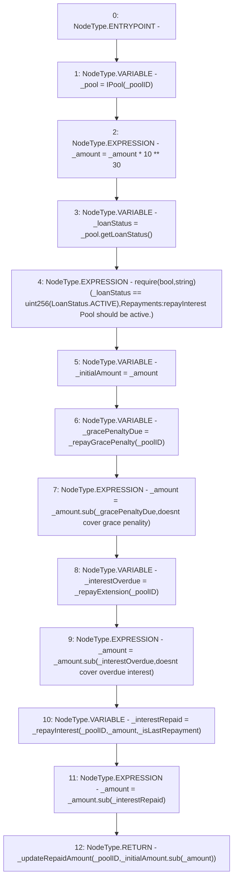

# Context: Repayments._repay

**Contract:** `Repayments` (Inherits: ReentrancyGuard, IRepayment, Initializable)
**Signature:** `_repay(address,uint256,bool) returns (uint256)`
**Method Selector ID:** `Internal (No Method ID)`
**Visibility:** `internal`
**Environment-Free:** `No (reads EVM state context)`
**Modifiers:** None

### State Variables Interaction
- **Reads:** None
- **Writes:** None

### Assertion Checks & Business Requirements
- require/assert: `require(bool,string)(_loanStatus == uint256(LoanStatus.ACTIVE),Repayments:repayInterest Pool should be active.)`

### Environment & Verification Flags
- **Uses Foundry Cheatcodes:** No
- **Has Echidna Properties:** No

### Internal Calls Tree
- None

### External Calls / Value Transfers
- `SafeMath.TMP_2295(uint256) = LIBRARY_CALL, dest:SafeMath, function:SafeMath.sub(uint256,uint256,string), arguments:['_amount', '_gracePenaltyDue', 'doesnt cover grace penality'] `
- `SafeMath.TMP_2297(uint256) = LIBRARY_CALL, dest:SafeMath, function:SafeMath.sub(uint256,uint256,string), arguments:['_amount', '_interestOverdue', 'doesnt cover overdue interest'] `
- `SafeMath.TMP_2299(uint256) = LIBRARY_CALL, dest:SafeMath, function:SafeMath.sub(uint256,uint256), arguments:['_amount', '_interestRepaid'] `
- `SafeMath.TMP_2300(uint256) = LIBRARY_CALL, dest:SafeMath, function:SafeMath.sub(uint256,uint256), arguments:['_initialAmount', '_amount'] `
- `IPool.TMP_2290(uint256) = HIGH_LEVEL_CALL, dest:_pool(IPool), function:getLoanStatus, arguments:[]  `

### Control Flow Graph (CFG)


### Source Mapping
Declared in: `contracts/Pool/Repayments.sol` on lines **377** to **402**

```solidity
    function _repay(
        address _poolID,
        uint256 _amount,
        bool _isLastRepayment
    ) internal returns (uint256) {
        IPool _pool = IPool(_poolID);
        _amount = _amount * 10**30;
        uint256 _loanStatus = _pool.getLoanStatus();
        require(_loanStatus == uint(LoanStatus.ACTIVE) , 'Repayments:repayInterest Pool should be active.');

        uint256 _initialAmount = _amount;

        // pay off grace penality
        uint256 _gracePenaltyDue = _repayGracePenalty(_poolID);
        _amount = _amount.sub(_gracePenaltyDue, 'doesnt cover grace penality');

        // pay off the overdue
        uint256 _interestOverdue = _repayExtension(_poolID);
        _amount = _amount.sub(_interestOverdue, 'doesnt cover overdue interest');

        // pay interest
        uint256 _interestRepaid = _repayInterest(_poolID, _amount, _isLastRepayment);
        _amount = _amount.sub(_interestRepaid);

        return _updateRepaidAmount(_poolID, _initialAmount.sub(_amount));
    }

```
