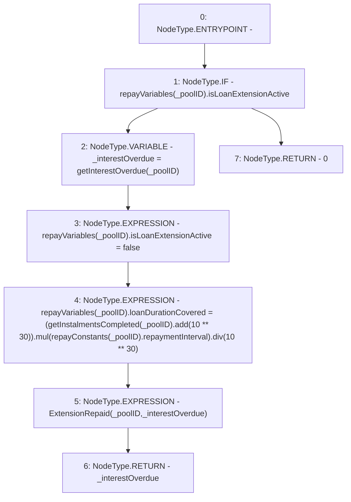

# Context: Repayments._repayExtension

**Contract:** `Repayments` (Inherits: ReentrancyGuard, IRepayment, Initializable)
**Signature:** `_repayExtension(address) returns (uint256)`
**Method Selector ID:** `Internal (No Method ID)`
**Visibility:** `internal`
**Environment-Free:** `Yes`
**Modifiers:** None

### State Variables Interaction
- **Reads:** repayConstants, repayVariables
- **Writes:** repayVariables

### Environment & Verification Flags
- **Uses Foundry Cheatcodes:** No
- **Has Echidna Properties:** No

### Internal Calls Tree
- None

### External Calls / Value Transfers
- `SafeMath.TMP_2262(uint256) = LIBRARY_CALL, dest:SafeMath, function:SafeMath.mul(uint256,uint256), arguments:['TMP_2261', 'REF_1035'] `
- `SafeMath.TMP_2261(uint256) = LIBRARY_CALL, dest:SafeMath, function:SafeMath.add(uint256,uint256), arguments:['TMP_2259', 'TMP_2260'] `
- `SafeMath.TMP_2264(uint256) = LIBRARY_CALL, dest:SafeMath, function:SafeMath.div(uint256,uint256), arguments:['TMP_2262', 'TMP_2263'] `

### Control Flow Graph (CFG)


### Source Mapping
Declared in: `contracts/Pool/Repayments.sol` on lines **324** to **336**

```solidity
    function _repayExtension(address _poolID) internal returns (uint256) {
        if (repayVariables[_poolID].isLoanExtensionActive) {
            uint256 _interestOverdue = getInterestOverdue(_poolID);
            repayVariables[_poolID].isLoanExtensionActive = false; // deactivate loan extension flag
            repayVariables[_poolID].loanDurationCovered = (getInstalmentsCompleted(_poolID).add(10**30))
                .mul(repayConstants[_poolID].repaymentInterval)
                .div(10**30);
            emit ExtensionRepaid(_poolID, _interestOverdue);
            return _interestOverdue;
        } else {
            return 0;
        }
    }

```
