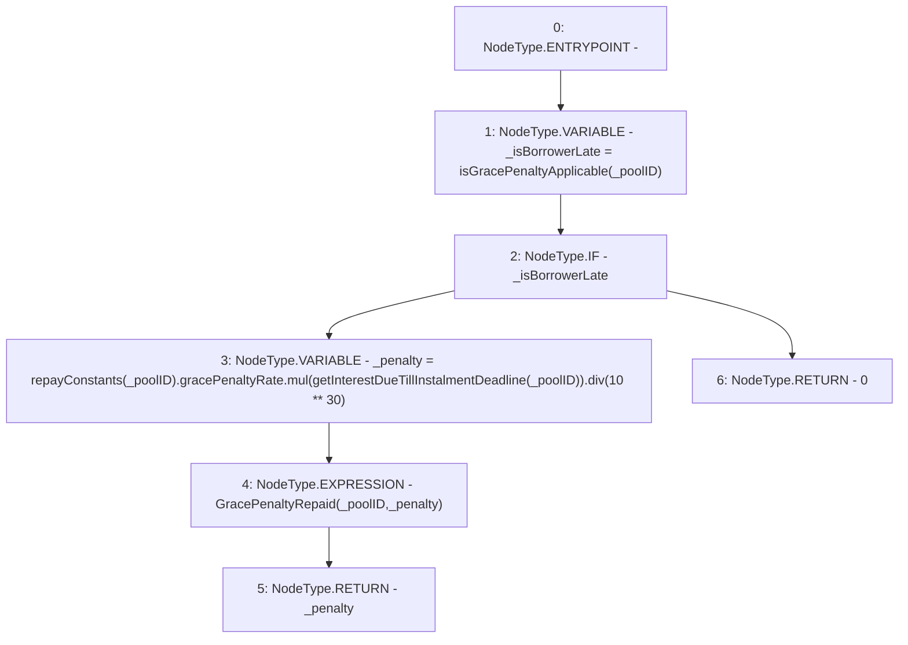

# Context: Repayments._repayGracePenalty

**Contract:** `Repayments` (Inherits: ReentrancyGuard, IRepayment, Initializable)
**Signature:** `_repayGracePenalty(address) returns (uint256)`
**Method Selector ID:** `Internal (No Method ID)`
**Visibility:** `internal`
**Environment-Free:** `No (reads EVM state context)`
**Modifiers:** None

### State Variables Interaction
- **Reads:** repayConstants
- **Writes:** None

### Environment & Verification Flags
- **Uses Foundry Cheatcodes:** No
- **Has Echidna Properties:** No

### Internal Calls Tree
- None

### External Calls / Value Transfers
- `SafeMath.TMP_2268(uint256) = LIBRARY_CALL, dest:SafeMath, function:SafeMath.mul(uint256,uint256), arguments:['REF_1038', 'TMP_2267'] `
- `SafeMath.TMP_2270(uint256) = LIBRARY_CALL, dest:SafeMath, function:SafeMath.div(uint256,uint256), arguments:['TMP_2268', 'TMP_2269'] `

### Control Flow Graph (CFG)


### Source Mapping
Declared in: `contracts/Pool/Repayments.sol` on lines **338** to **348**

```solidity
    function _repayGracePenalty(address _poolID) internal returns (uint256) {
        bool _isBorrowerLate = isGracePenaltyApplicable(_poolID);

        if (_isBorrowerLate) {
            uint256 _penalty = repayConstants[_poolID].gracePenaltyRate.mul(getInterestDueTillInstalmentDeadline(_poolID)).div(10**30);
            emit GracePenaltyRepaid(_poolID, _penalty);
            return _penalty;
        } else {
            return 0;
        }
    }

```
