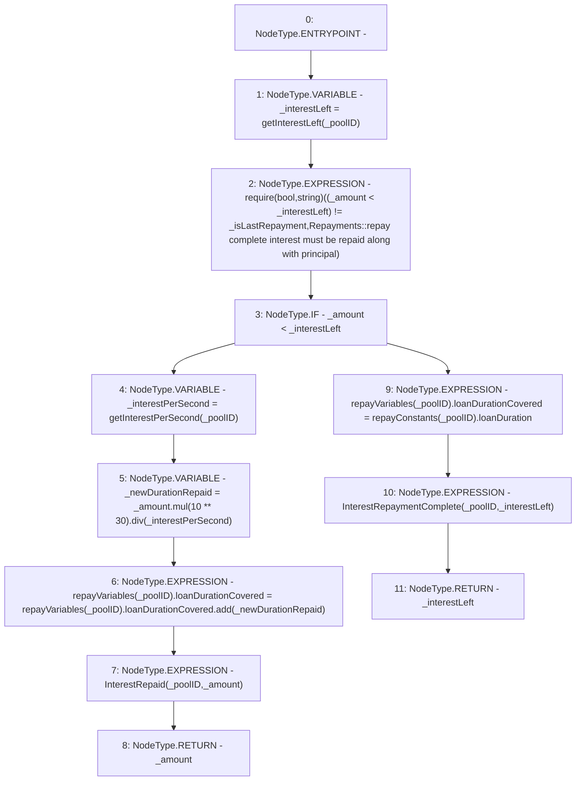

# Context: Repayments._repayInterest

**Contract:** `Repayments` (Inherits: ReentrancyGuard, IRepayment, Initializable)
**Signature:** `_repayInterest(address,uint256,bool) returns (uint256)`
**Method Selector ID:** `Internal (No Method ID)`
**Visibility:** `internal`
**Environment-Free:** `Yes`
**Modifiers:** None

### State Variables Interaction
- **Reads:** repayConstants, repayVariables
- **Writes:** repayVariables

### Assertion Checks & Business Requirements
- require/assert: `require(bool,string)((_amount < _interestLeft) != _isLastRepayment,Repayments::repay complete interest must be repaid along with principal)`

### Environment & Verification Flags
- **Uses Foundry Cheatcodes:** No
- **Has Echidna Properties:** No

### Internal Calls Tree
- None

### External Calls / Value Transfers
- `SafeMath.TMP_2280(uint256) = LIBRARY_CALL, dest:SafeMath, function:SafeMath.div(uint256,uint256), arguments:['TMP_2279', '_interestPerSecond'] `
- `SafeMath.TMP_2281(uint256) = LIBRARY_CALL, dest:SafeMath, function:SafeMath.add(uint256,uint256), arguments:['REF_1046', '_newDurationRepaid'] `
- `SafeMath.TMP_2279(uint256) = LIBRARY_CALL, dest:SafeMath, function:SafeMath.mul(uint256,uint256), arguments:['_amount', 'TMP_2278'] `

### Control Flow Graph (CFG)


### Source Mapping
Declared in: `contracts/Pool/Repayments.sol` on lines **350** to **369**

```solidity
    function _repayInterest(
        address _poolID,
        uint256 _amount,
        bool _isLastRepayment
    ) internal returns (uint256) {
        uint256 _interestLeft = getInterestLeft(_poolID);
        require((_amount < _interestLeft) != _isLastRepayment, 'Repayments::repay complete interest must be repaid along with principal');

        if (_amount < _interestLeft) {
            uint256 _interestPerSecond = getInterestPerSecond(_poolID);
            uint256 _newDurationRepaid = _amount.mul(10**30).div(_interestPerSecond); // dividing exponents
            repayVariables[_poolID].loanDurationCovered = repayVariables[_poolID].loanDurationCovered.add(_newDurationRepaid);
            emit InterestRepaid(_poolID, _amount);
            return _amount;
        } else {
            repayVariables[_poolID].loanDurationCovered = repayConstants[_poolID].loanDuration; // full interest repaid
            emit InterestRepaymentComplete(_poolID, _interestLeft);
            return _interestLeft;
        }
    }

```
