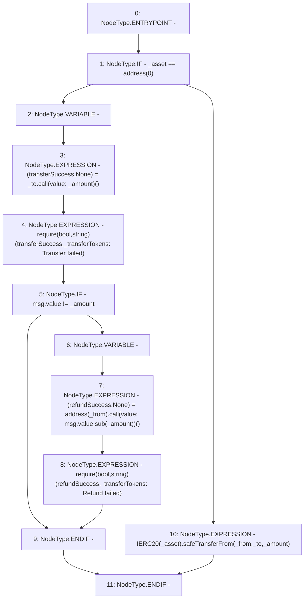

# Context: Repayments._transferTokens

**Contract:** `Repayments` (Inherits: ReentrancyGuard, IRepayment, Initializable)
**Signature:** `_transferTokens(address,address,address,uint256)`
**Method Selector ID:** `Internal (No Method ID)`
**Visibility:** `internal`
**Environment-Free:** `No (reads EVM state context)`
**Modifiers:** None

### State Variables Interaction
- **Reads:** None
- **Writes:** None

### Assertion Checks & Business Requirements
- require/assert: `require(bool,string)(transferSuccess,_transferTokens: Transfer failed)`
- require/assert: `require(bool,string)(refundSuccess,_transferTokens: Refund failed)`

### Environment & Verification Flags
- **Uses Foundry Cheatcodes:** No
- **Has Echidna Properties:** No

### Internal Calls Tree
- None

### External Calls / Value Transfers
- `SafeERC20.LIBRARY_CALL, dest:SafeERC20, function:SafeERC20.safeTransferFrom(IERC20,address,address,uint256), arguments:['TMP_2328', '_from', '_to', '_amount'] `
- `SafeMath.TMP_2326(uint256) = LIBRARY_CALL, dest:SafeMath, function:SafeMath.sub(uint256,uint256), arguments:['msg.value', '_amount'] `
- `TMP_2327(None) = SOLIDITY_CALL require(bool,string)(refundSuccess,_transferTokens: Refund failed)`
- `TMP_2323(None) = SOLIDITY_CALL require(bool,string)(transferSuccess,_transferTokens: Transfer failed)`
- `low-level-call`

### Control Flow Graph (CFG)


### Source Mapping
Declared in: `contracts/Pool/Repayments.sol` on lines **457** to **473**

```solidity
    function _transferTokens(
        address _from,
        address _to,
        address _asset,
        uint256 _amount
    ) internal {
        if (_asset == address(0)) {
            (bool transferSuccess, ) = _to.call{value: _amount}('');
            require(transferSuccess, '_transferTokens: Transfer failed');
            if (msg.value != _amount) {
                (bool refundSuccess, ) = payable(_from).call{value: msg.value.sub(_amount)}('');
                require(refundSuccess, '_transferTokens: Refund failed');
            }
        } else {
            IERC20(_asset).safeTransferFrom(_from, _to, _amount);
        }
    }

```
