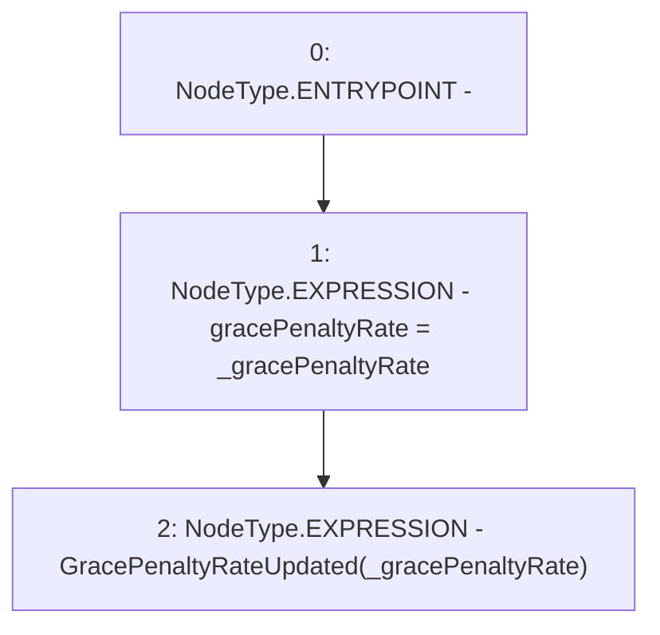

# Context: Repayments._updateGracePenaltyRate

**Contract:** `Repayments` (Inherits: ReentrancyGuard, IRepayment, Initializable)
**Signature:** `_updateGracePenaltyRate(uint256)`
**Method Selector ID:** `Internal (No Method ID)`
**Visibility:** `internal`
**Environment-Free:** `Yes`
**Modifiers:** None

### State Variables Interaction
- **Reads:** None
- **Writes:** gracePenaltyRate

### Environment & Verification Flags
- **Uses Foundry Cheatcodes:** No
- **Has Echidna Properties:** No

### Internal Calls Tree
- None

### External Calls / Value Transfers
- None

### Control Flow Graph (CFG)


### Source Mapping
Declared in: `contracts/Pool/Repayments.sol` on lines **142** to **145**

```solidity
    function _updateGracePenaltyRate(uint256 _gracePenaltyRate) internal {
        gracePenaltyRate = _gracePenaltyRate;
        emit GracePenaltyRateUpdated(_gracePenaltyRate);
    }

```
