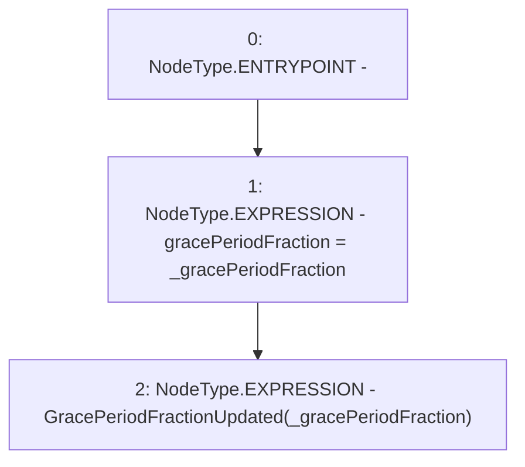

# Context: Repayments._updateGracePeriodFraction

**Contract:** `Repayments` (Inherits: ReentrancyGuard, IRepayment, Initializable)
**Signature:** `_updateGracePeriodFraction(uint256)`
**Method Selector ID:** `Internal (No Method ID)`
**Visibility:** `internal`
**Environment-Free:** `Yes`
**Modifiers:** None

### State Variables Interaction
- **Reads:** None
- **Writes:** gracePeriodFraction

### Environment & Verification Flags
- **Uses Foundry Cheatcodes:** No
- **Has Echidna Properties:** No

### Internal Calls Tree
- None

### External Calls / Value Transfers
- None

### Control Flow Graph (CFG)


### Source Mapping
Declared in: `contracts/Pool/Repayments.sol` on lines **129** to **132**

```solidity
    function _updateGracePeriodFraction(uint256 _gracePeriodFraction) internal {
        gracePeriodFraction = _gracePeriodFraction;
        emit GracePeriodFractionUpdated(_gracePeriodFraction);
    }

```
