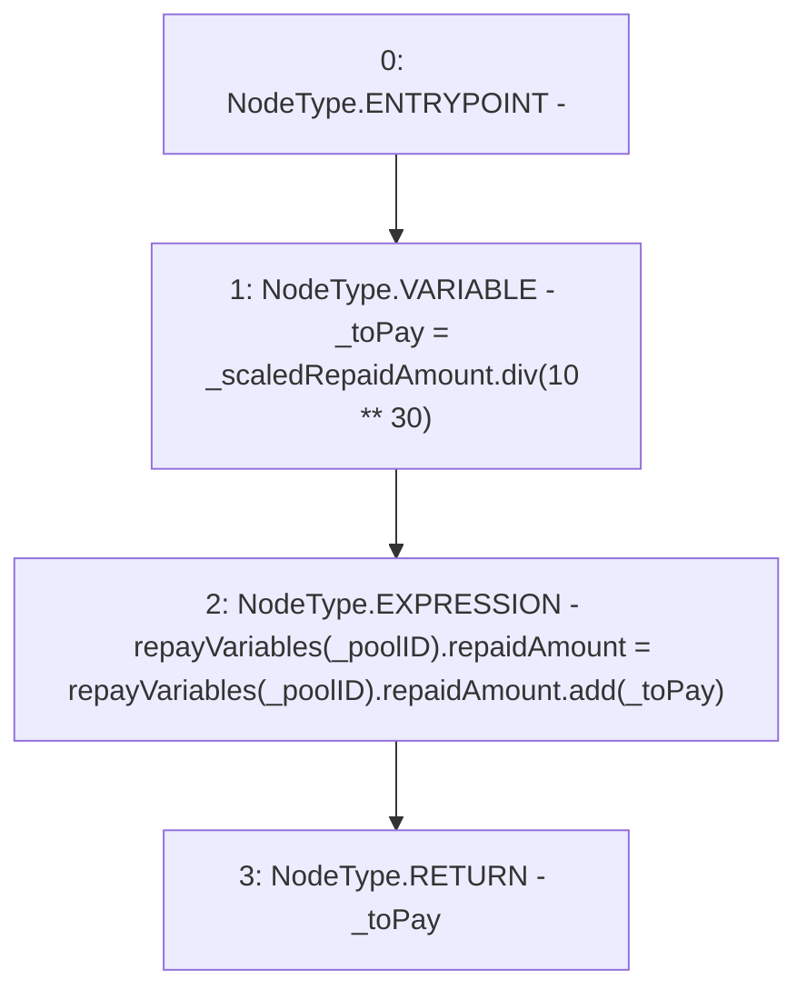

# Context: Repayments._updateRepaidAmount

**Contract:** `Repayments` (Inherits: ReentrancyGuard, IRepayment, Initializable)
**Signature:** `_updateRepaidAmount(address,uint256) returns (uint256)`
**Method Selector ID:** `Internal (No Method ID)`
**Visibility:** `internal`
**Environment-Free:** `Yes`
**Modifiers:** None

### State Variables Interaction
- **Reads:** repayVariables
- **Writes:** repayVariables

### Environment & Verification Flags
- **Uses Foundry Cheatcodes:** No
- **Has Echidna Properties:** No

### Internal Calls Tree
- None

### External Calls / Value Transfers
- `SafeMath.TMP_2286(uint256) = LIBRARY_CALL, dest:SafeMath, function:SafeMath.add(uint256,uint256), arguments:['REF_1056', '_toPay'] `
- `SafeMath.TMP_2285(uint256) = LIBRARY_CALL, dest:SafeMath, function:SafeMath.div(uint256,uint256), arguments:['_scaledRepaidAmount', 'TMP_2284'] `

### Control Flow Graph (CFG)


### Source Mapping
Declared in: `contracts/Pool/Repayments.sol` on lines **371** to **375**

```solidity
    function _updateRepaidAmount(address _poolID, uint256 _scaledRepaidAmount) internal returns (uint256) {
        uint256 _toPay = _scaledRepaidAmount.div(10**30);
        repayVariables[_poolID].repaidAmount = repayVariables[_poolID].repaidAmount.add(_toPay);
        return _toPay;
    }

```
