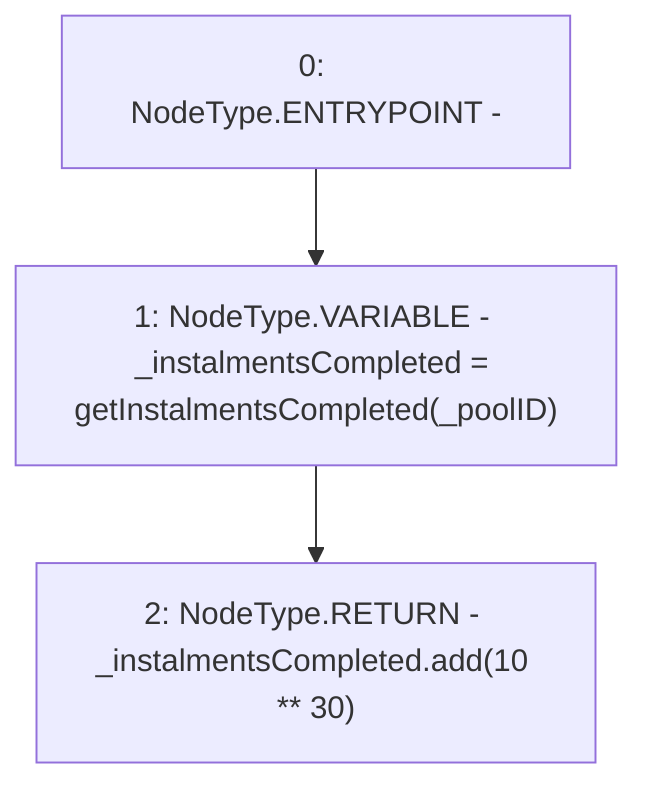

# Context: Repayments.getCurrentInstalmentInterval

**Contract:** `Repayments` (Inherits: ReentrancyGuard, IRepayment, Initializable)
**Signature:** `getCurrentInstalmentInterval(address) returns (uint256)`
**Method Selector ID:** `0x2c7f475a`
**Visibility:** `public`
**Environment-Free:** `Yes`
**Modifiers:** None

### State Variables Interaction
- **Reads:** None
- **Writes:** None

### Environment & Verification Flags
- **Uses Foundry Cheatcodes:** No
- **Has Echidna Properties:** No

### Internal Calls Tree
- None

### External Calls / Value Transfers
- `SafeMath.TMP_2210(uint256) = LIBRARY_CALL, dest:SafeMath, function:SafeMath.add(uint256,uint256), arguments:['_instalmentsCompleted', 'TMP_2209'] `

### Control Flow Graph (CFG)


### Source Mapping
Declared in: `contracts/Pool/Repayments.sol` on lines **234** to **237**

```solidity
    function getCurrentInstalmentInterval(address _poolID) public view returns (uint256) {
        uint256 _instalmentsCompleted = getInstalmentsCompleted(_poolID);
        return _instalmentsCompleted.add(10**30);
    }

```
