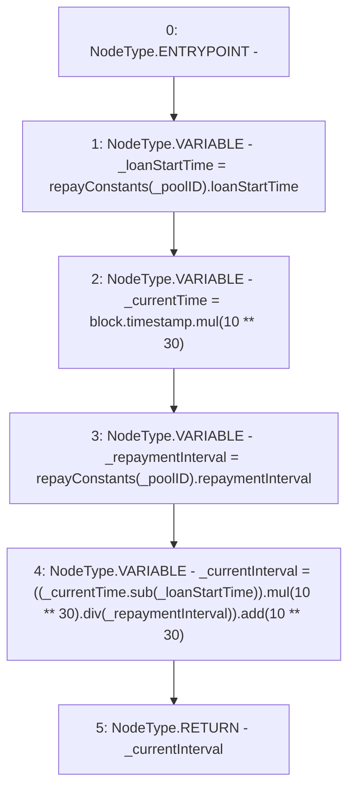

# Context: Repayments.getCurrentLoanInterval

**Contract:** `Repayments` (Inherits: ReentrancyGuard, IRepayment, Initializable)
**Signature:** `getCurrentLoanInterval(address) returns (uint256)`
**Method Selector ID:** `0xf2a8a806`
**Visibility:** `external`
**Environment-Free:** `No (reads EVM state context)`
**Modifiers:** None

### State Variables Interaction
- **Reads:** repayConstants
- **Writes:** None

### Environment & Verification Flags
- **Uses Foundry Cheatcodes:** No
- **Has Echidna Properties:** No

### Internal Calls Tree
- None

### External Calls / Value Transfers
- `SafeMath.TMP_2218(uint256) = LIBRARY_CALL, dest:SafeMath, function:SafeMath.add(uint256,uint256), arguments:['TMP_2216', 'TMP_2217'] `
- `SafeMath.TMP_2215(uint256) = LIBRARY_CALL, dest:SafeMath, function:SafeMath.mul(uint256,uint256), arguments:['TMP_2213', 'TMP_2214'] `
- `SafeMath.TMP_2213(uint256) = LIBRARY_CALL, dest:SafeMath, function:SafeMath.sub(uint256,uint256), arguments:['_currentTime', '_loanStartTime'] `
- `SafeMath.TMP_2216(uint256) = LIBRARY_CALL, dest:SafeMath, function:SafeMath.div(uint256,uint256), arguments:['TMP_2215', '_repaymentInterval'] `
- `SafeMath.TMP_2212(uint256) = LIBRARY_CALL, dest:SafeMath, function:SafeMath.mul(uint256,uint256), arguments:['block.timestamp', 'TMP_2211'] `

### Control Flow Graph (CFG)


### Source Mapping
Declared in: `contracts/Pool/Repayments.sol` on lines **243** to **250**

```solidity
    function getCurrentLoanInterval(address _poolID) external view override returns (uint256) {
        uint256 _loanStartTime = repayConstants[_poolID].loanStartTime;
        uint256 _currentTime = block.timestamp.mul(10**30);
        uint256 _repaymentInterval = repayConstants[_poolID].repaymentInterval;
        uint256 _currentInterval = ((_currentTime.sub(_loanStartTime)).mul(10**30).div(_repaymentInterval)).add(10**30);

        return _currentInterval;
    }

```
