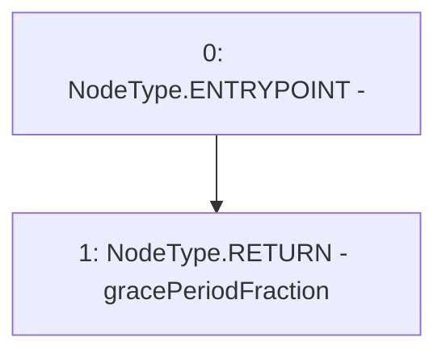

# Context: Repayments.getGracePeriodFraction

**Contract:** `Repayments` (Inherits: ReentrancyGuard, IRepayment, Initializable)
**Signature:** `getGracePeriodFraction() returns (uint256)`
**Method Selector ID:** `0x1928570b`
**Visibility:** `external`
**Environment-Free:** `Yes`
**Modifiers:** None

### State Variables Interaction
- **Reads:** gracePeriodFraction
- **Writes:** None

### Environment & Verification Flags
- **Uses Foundry Cheatcodes:** No
- **Has Echidna Properties:** No

### Internal Calls Tree
- None

### External Calls / Value Transfers
- None

### Control Flow Graph (CFG)


### Source Mapping
Declared in: `contracts/Pool/Repayments.sol` on lines **453** to **455**

```solidity
    function getGracePeriodFraction() external view override returns (uint256) {
        return gracePeriodFraction;
    }

```
