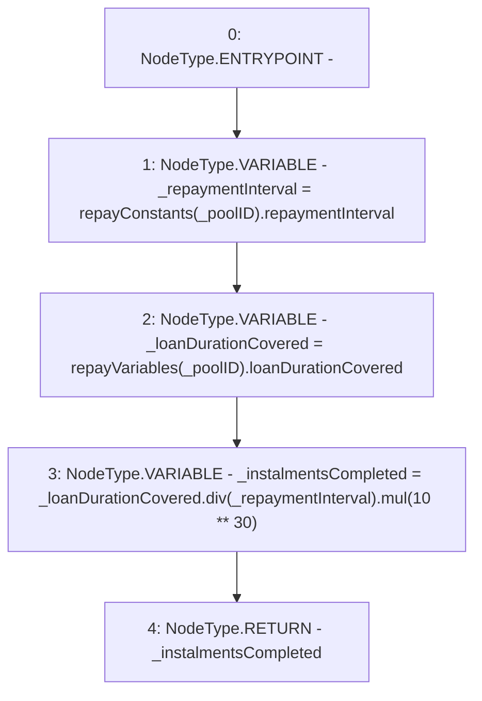

# Context: Repayments.getInstalmentsCompleted

**Contract:** `Repayments` (Inherits: ReentrancyGuard, IRepayment, Initializable)
**Signature:** `getInstalmentsCompleted(address) returns (uint256)`
**Method Selector ID:** `0x4bbf2047`
**Visibility:** `public`
**Environment-Free:** `Yes`
**Modifiers:** None

### State Variables Interaction
- **Reads:** repayConstants, repayVariables
- **Writes:** None

### Environment & Verification Flags
- **Uses Foundry Cheatcodes:** No
- **Has Echidna Properties:** No

### Internal Calls Tree
- None

### External Calls / Value Transfers
- `SafeMath.TMP_2178(uint256) = LIBRARY_CALL, dest:SafeMath, function:SafeMath.div(uint256,uint256), arguments:['_loanDurationCovered', '_repaymentInterval'] `
- `SafeMath.TMP_2180(uint256) = LIBRARY_CALL, dest:SafeMath, function:SafeMath.mul(uint256,uint256), arguments:['TMP_2178', 'TMP_2179'] `

### Control Flow Graph (CFG)


### Source Mapping
Declared in: `contracts/Pool/Repayments.sol` on lines **187** to **193**

```solidity
    function getInstalmentsCompleted(address _poolID) public view returns (uint256) {
        uint256 _repaymentInterval = repayConstants[_poolID].repaymentInterval;
        uint256 _loanDurationCovered = repayVariables[_poolID].loanDurationCovered;
        uint256 _instalmentsCompleted = _loanDurationCovered.div(_repaymentInterval).mul(10**30); // dividing exponents, returns whole number rounded down

        return _instalmentsCompleted;
    }

```
