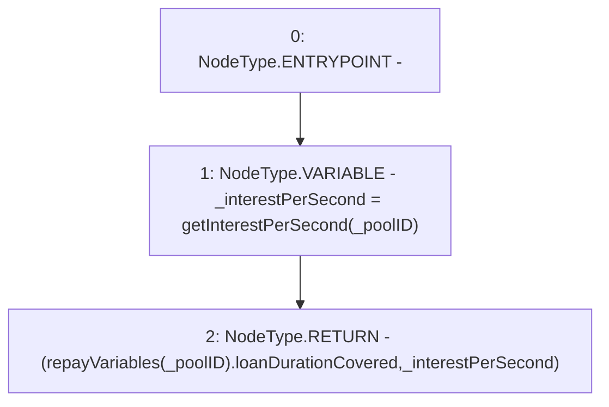

# Context: Repayments.getInterestCalculationVars

**Contract:** `Repayments` (Inherits: ReentrancyGuard, IRepayment, Initializable)
**Signature:** `getInterestCalculationVars(address) returns (uint256, uint256)`
**Method Selector ID:** `0xffe90fd5`
**Visibility:** `external`
**Environment-Free:** `Yes`
**Modifiers:** None

### State Variables Interaction
- **Reads:** repayVariables
- **Writes:** None

### Environment & Verification Flags
- **Uses Foundry Cheatcodes:** No
- **Has Echidna Properties:** No

### Internal Calls Tree
- None

### External Calls / Value Transfers
- None

### Control Flow Graph (CFG)


### Source Mapping
Declared in: `contracts/Pool/Repayments.sol` on lines **446** to **449**

```solidity
    function getInterestCalculationVars(address _poolID) external view override returns (uint256, uint256) {
        uint256 _interestPerSecond = getInterestPerSecond(_poolID);
        return (repayVariables[_poolID].loanDurationCovered, _interestPerSecond);
    }

```
