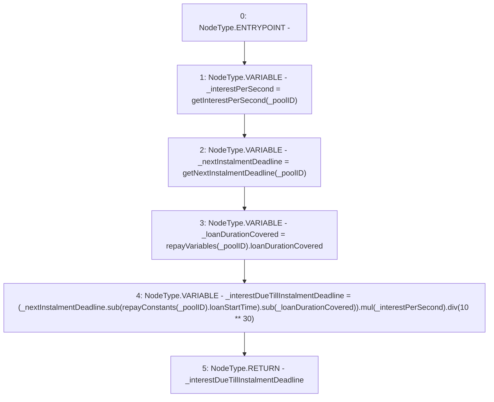

# Context: Repayments.getInterestDueTillInstalmentDeadline

**Contract:** `Repayments` (Inherits: ReentrancyGuard, IRepayment, Initializable)
**Signature:** `getInterestDueTillInstalmentDeadline(address) returns (uint256)`
**Method Selector ID:** `0x0d3a4ef8`
**Visibility:** `public`
**Environment-Free:** `Yes`
**Modifiers:** None

### State Variables Interaction
- **Reads:** repayConstants, repayVariables
- **Writes:** None

### Environment & Verification Flags
- **Uses Foundry Cheatcodes:** No
- **Has Echidna Properties:** No

### Internal Calls Tree
- None

### External Calls / Value Transfers
- `SafeMath.TMP_2184(uint256) = LIBRARY_CALL, dest:SafeMath, function:SafeMath.sub(uint256,uint256), arguments:['TMP_2183', '_loanDurationCovered'] `
- `SafeMath.TMP_2187(uint256) = LIBRARY_CALL, dest:SafeMath, function:SafeMath.div(uint256,uint256), arguments:['TMP_2185', 'TMP_2186'] `
- `SafeMath.TMP_2185(uint256) = LIBRARY_CALL, dest:SafeMath, function:SafeMath.mul(uint256,uint256), arguments:['TMP_2184', '_interestPerSecond'] `
- `SafeMath.TMP_2183(uint256) = LIBRARY_CALL, dest:SafeMath, function:SafeMath.sub(uint256,uint256), arguments:['_nextInstalmentDeadline', 'REF_957'] `

### Control Flow Graph (CFG)


### Source Mapping
Declared in: `contracts/Pool/Repayments.sol` on lines **198** to **206**

```solidity
    function getInterestDueTillInstalmentDeadline(address _poolID) public view returns (uint256) {
        uint256 _interestPerSecond = getInterestPerSecond(_poolID);
        uint256 _nextInstalmentDeadline = getNextInstalmentDeadline(_poolID);
        uint256 _loanDurationCovered = repayVariables[_poolID].loanDurationCovered;
        uint256 _interestDueTillInstalmentDeadline = (
            _nextInstalmentDeadline.sub(repayConstants[_poolID].loanStartTime).sub(_loanDurationCovered)
        ).mul(_interestPerSecond).div(10**30);
        return _interestDueTillInstalmentDeadline;
    }

```
