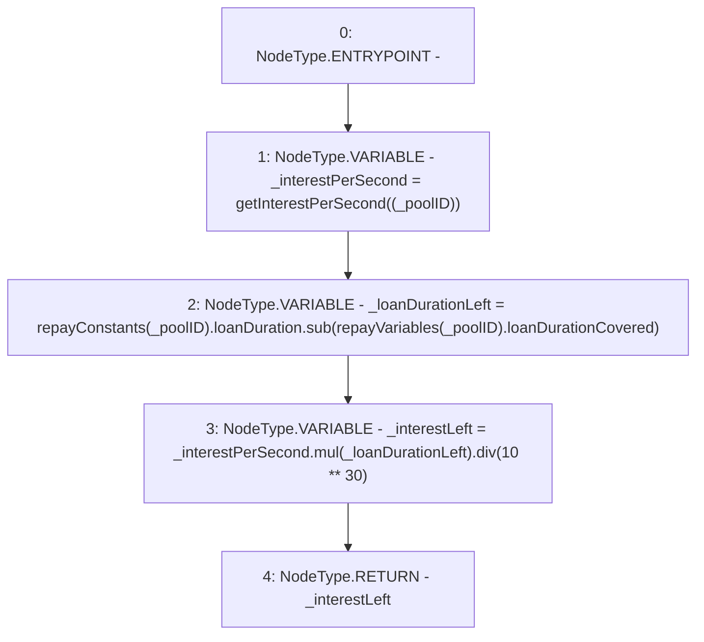

# Context: Repayments.getInterestLeft

**Contract:** `Repayments` (Inherits: ReentrancyGuard, IRepayment, Initializable)
**Signature:** `getInterestLeft(address) returns (uint256)`
**Method Selector ID:** `0x1a34ae18`
**Visibility:** `public`
**Environment-Free:** `Yes`
**Modifiers:** None

### State Variables Interaction
- **Reads:** repayConstants, repayVariables
- **Writes:** None

### Environment & Verification Flags
- **Uses Foundry Cheatcodes:** No
- **Has Echidna Properties:** No

### Internal Calls Tree
- None

### External Calls / Value Transfers
- `SafeMath.TMP_2241(uint256) = LIBRARY_CALL, dest:SafeMath, function:SafeMath.div(uint256,uint256), arguments:['TMP_2239', 'TMP_2240'] `
- `SafeMath.TMP_2239(uint256) = LIBRARY_CALL, dest:SafeMath, function:SafeMath.mul(uint256,uint256), arguments:['_interestPerSecond', '_loanDurationLeft'] `
- `SafeMath.TMP_2238(uint256) = LIBRARY_CALL, dest:SafeMath, function:SafeMath.sub(uint256,uint256), arguments:['REF_1006', 'REF_1009'] `

### Control Flow Graph (CFG)


### Source Mapping
Declared in: `contracts/Pool/Repayments.sol` on lines **287** to **293**

```solidity
    function getInterestLeft(address _poolID) public view returns (uint256) {
        uint256 _interestPerSecond = getInterestPerSecond((_poolID));
        uint256 _loanDurationLeft = repayConstants[_poolID].loanDuration.sub(repayVariables[_poolID].loanDurationCovered);
        uint256 _interestLeft = _interestPerSecond.mul(_loanDurationLeft).div(10**30); // multiplying exponents

        return _interestLeft;
    }

```
