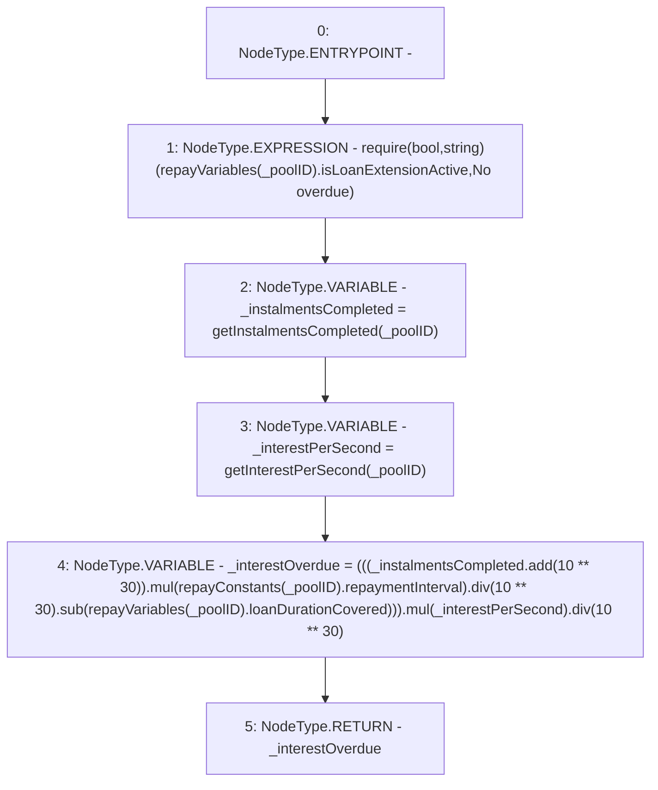

# Context: Repayments.getInterestOverdue

**Contract:** `Repayments` (Inherits: ReentrancyGuard, IRepayment, Initializable)
**Signature:** `getInterestOverdue(address) returns (uint256)`
**Method Selector ID:** `0xef3bcd18`
**Visibility:** `public`
**Environment-Free:** `Yes`
**Modifiers:** None

### State Variables Interaction
- **Reads:** repayConstants, repayVariables
- **Writes:** None

### Assertion Checks & Business Requirements
- require/assert: `require(bool,string)(repayVariables[_poolID].isLoanExtensionActive,No overdue)`

### Environment & Verification Flags
- **Uses Foundry Cheatcodes:** No
- **Has Echidna Properties:** No

### Internal Calls Tree
- None

### External Calls / Value Transfers
- `SafeMath.TMP_2250(uint256) = LIBRARY_CALL, dest:SafeMath, function:SafeMath.sub(uint256,uint256), arguments:['TMP_2249', 'REF_1021'] `
- `SafeMath.TMP_2251(uint256) = LIBRARY_CALL, dest:SafeMath, function:SafeMath.mul(uint256,uint256), arguments:['TMP_2250', '_interestPerSecond'] `
- `SafeMath.TMP_2247(uint256) = LIBRARY_CALL, dest:SafeMath, function:SafeMath.mul(uint256,uint256), arguments:['TMP_2246', 'REF_1017'] `
- `SafeMath.TMP_2246(uint256) = LIBRARY_CALL, dest:SafeMath, function:SafeMath.add(uint256,uint256), arguments:['_instalmentsCompleted', 'TMP_2245'] `
- `SafeMath.TMP_2253(uint256) = LIBRARY_CALL, dest:SafeMath, function:SafeMath.div(uint256,uint256), arguments:['TMP_2251', 'TMP_2252'] `
- `SafeMath.TMP_2249(uint256) = LIBRARY_CALL, dest:SafeMath, function:SafeMath.div(uint256,uint256), arguments:['TMP_2247', 'TMP_2248'] `

### Control Flow Graph (CFG)


### Source Mapping
Declared in: `contracts/Pool/Repayments.sol` on lines **299** to **311**

```solidity
    function getInterestOverdue(address _poolID) public view returns (uint256) {
        require(repayVariables[_poolID].isLoanExtensionActive, 'No overdue');
        uint256 _instalmentsCompleted = getInstalmentsCompleted(_poolID);
        uint256 _interestPerSecond = getInterestPerSecond(_poolID);
        uint256 _interestOverdue = (
            (
                (_instalmentsCompleted.add(10**30)).mul(repayConstants[_poolID].repaymentInterval).div(10**30).sub(
                    repayVariables[_poolID].loanDurationCovered
                )
            )
        ).mul(_interestPerSecond).div(10**30);
        return _interestOverdue;
    }

```
