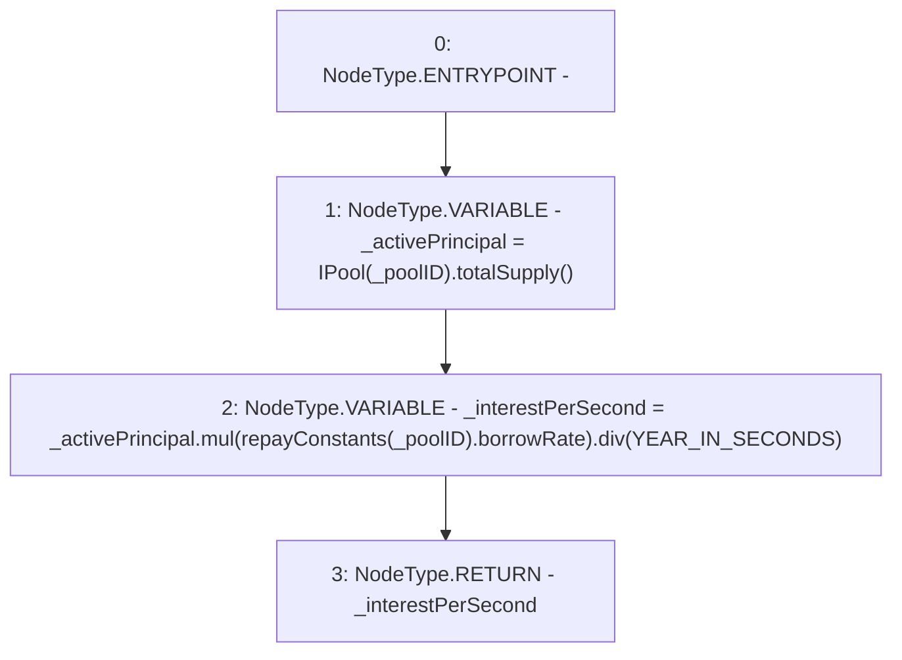

# Context: Repayments.getInterestPerSecond

**Contract:** `Repayments` (Inherits: ReentrancyGuard, IRepayment, Initializable)
**Signature:** `getInterestPerSecond(address) returns (uint256)`
**Method Selector ID:** `0xfb780e89`
**Visibility:** `public`
**Environment-Free:** `Yes`
**Modifiers:** None

### State Variables Interaction
- **Reads:** YEAR_IN_SECONDS, repayConstants
- **Writes:** None

### Environment & Verification Flags
- **Uses Foundry Cheatcodes:** No
- **Has Echidna Properties:** No

### Internal Calls Tree
- None

### External Calls / Value Transfers
- `IPool.TMP_2175(uint256) = HIGH_LEVEL_CALL, dest:TMP_2174(IPool), function:totalSupply, arguments:[]  `
- `SafeMath.TMP_2176(uint256) = LIBRARY_CALL, dest:SafeMath, function:SafeMath.mul(uint256,uint256), arguments:['_activePrincipal', 'REF_945'] `
- `SafeMath.TMP_2177(uint256) = LIBRARY_CALL, dest:SafeMath, function:SafeMath.div(uint256,uint256), arguments:['TMP_2176', 'YEAR_IN_SECONDS'] `

### Control Flow Graph (CFG)


### Source Mapping
Declared in: `contracts/Pool/Repayments.sol` on lines **178** to **182**

```solidity
    function getInterestPerSecond(address _poolID) public view returns (uint256) {
        uint256 _activePrincipal = IPool(_poolID).totalSupply();
        uint256 _interestPerSecond = _activePrincipal.mul(repayConstants[_poolID].borrowRate).div(YEAR_IN_SECONDS);
        return _interestPerSecond;
    }

```
