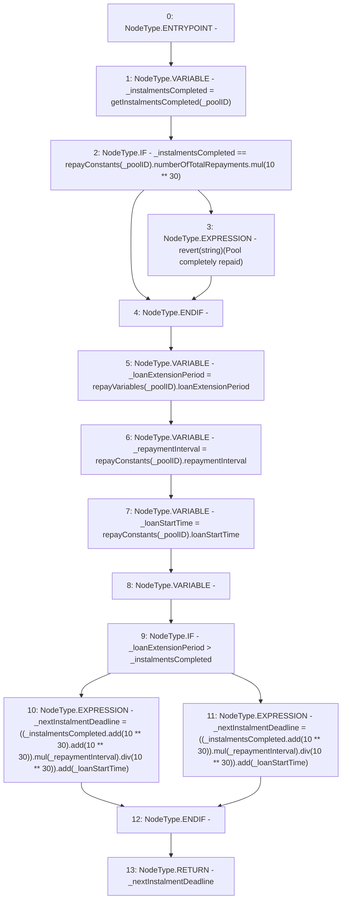

# Context: Repayments.getNextInstalmentDeadline

**Contract:** `Repayments` (Inherits: ReentrancyGuard, IRepayment, Initializable)
**Signature:** `getNextInstalmentDeadline(address) returns (uint256)`
**Method Selector ID:** `0xbf3b8e4b`
**Visibility:** `public`
**Environment-Free:** `Yes`
**Modifiers:** None

### State Variables Interaction
- **Reads:** repayConstants, repayVariables
- **Writes:** None

### Assertion Checks & Business Requirements
- revert: `revert(string)(Pool completely repaid)`

### Environment & Verification Flags
- **Uses Foundry Cheatcodes:** No
- **Has Echidna Properties:** No

### Internal Calls Tree
- None

### External Calls / Value Transfers
- `SafeMath.TMP_2198(uint256) = LIBRARY_CALL, dest:SafeMath, function:SafeMath.mul(uint256,uint256), arguments:['TMP_2197', '_repaymentInterval'] `
- `SafeMath.TMP_2204(uint256) = LIBRARY_CALL, dest:SafeMath, function:SafeMath.mul(uint256,uint256), arguments:['TMP_2203', '_repaymentInterval'] `
- `SafeMath.TMP_2203(uint256) = LIBRARY_CALL, dest:SafeMath, function:SafeMath.add(uint256,uint256), arguments:['_instalmentsCompleted', 'TMP_2202'] `
- `SafeMath.TMP_2200(uint256) = LIBRARY_CALL, dest:SafeMath, function:SafeMath.div(uint256,uint256), arguments:['TMP_2198', 'TMP_2199'] `
- `SafeMath.TMP_2206(uint256) = LIBRARY_CALL, dest:SafeMath, function:SafeMath.div(uint256,uint256), arguments:['TMP_2204', 'TMP_2205'] `
- `SafeMath.TMP_2195(uint256) = LIBRARY_CALL, dest:SafeMath, function:SafeMath.add(uint256,uint256), arguments:['_instalmentsCompleted', 'TMP_2194'] `
- `SafeMath.TMP_2197(uint256) = LIBRARY_CALL, dest:SafeMath, function:SafeMath.add(uint256,uint256), arguments:['TMP_2195', 'TMP_2196'] `
- `SafeMath.TMP_2207(uint256) = LIBRARY_CALL, dest:SafeMath, function:SafeMath.add(uint256,uint256), arguments:['TMP_2206', '_loanStartTime'] `
- `SafeMath.TMP_2201(uint256) = LIBRARY_CALL, dest:SafeMath, function:SafeMath.add(uint256,uint256), arguments:['TMP_2200', '_loanStartTime'] `
- `SafeMath.TMP_2190(uint256) = LIBRARY_CALL, dest:SafeMath, function:SafeMath.mul(uint256,uint256), arguments:['REF_962', 'TMP_2189'] `

### Control Flow Graph (CFG)


### Source Mapping
Declared in: `contracts/Pool/Repayments.sol` on lines **211** to **229**

```solidity
    function getNextInstalmentDeadline(address _poolID) public view override returns (uint256) {
        uint256 _instalmentsCompleted = getInstalmentsCompleted(_poolID);
        if (_instalmentsCompleted == repayConstants[_poolID].numberOfTotalRepayments.mul(10**30)) {
            revert('Pool completely repaid');
        }
        uint256 _loanExtensionPeriod = repayVariables[_poolID].loanExtensionPeriod;
        uint256 _repaymentInterval = repayConstants[_poolID].repaymentInterval;
        uint256 _loanStartTime = repayConstants[_poolID].loanStartTime;
        uint256 _nextInstalmentDeadline;

        if (_loanExtensionPeriod > _instalmentsCompleted) {
            _nextInstalmentDeadline = ((_instalmentsCompleted.add(10**30).add(10**30)).mul(_repaymentInterval).div(10**30)).add(
                _loanStartTime
            );
        } else {
            _nextInstalmentDeadline = ((_instalmentsCompleted.add(10**30)).mul(_repaymentInterval).div(10**30)).add(_loanStartTime);
        }
        return _nextInstalmentDeadline;
    }

```
