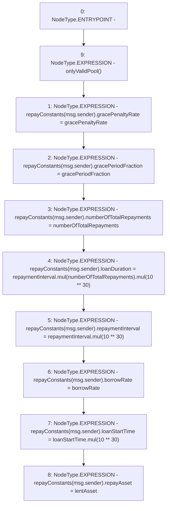

# Context: Repayments.initializeRepayment

**Contract:** `Repayments` (Inherits: ReentrancyGuard, IRepayment, Initializable)
**Signature:** `initializeRepayment(uint256,uint256,uint256,uint256,address)`
**Method Selector ID:** `0x488fc94e`
**Visibility:** `external`
**Environment-Free:** `No (reads EVM state context)`
**Modifiers:**
- `onlyValidPool`
  ```solidity
  modifier onlyValidPool() {
          require(poolFactory.poolRegistry(msg.sender), 'Repayments::onlyValidPool - Invalid Pool');
          _;
      }
  ```

### State Variables Interaction
- **Reads:** gracePenaltyRate, gracePeriodFraction, repayConstants
- **Writes:** repayConstants

### Environment & Verification Flags
- **Uses Foundry Cheatcodes:** No
- **Has Echidna Properties:** No

### Internal Calls Tree
- None

### External Calls / Value Transfers
- `SafeMath.TMP_2172(uint256) = LIBRARY_CALL, dest:SafeMath, function:SafeMath.mul(uint256,uint256), arguments:['loanStartTime', 'TMP_2171'] `
- `SafeMath.TMP_2168(uint256) = LIBRARY_CALL, dest:SafeMath, function:SafeMath.mul(uint256,uint256), arguments:['TMP_2166', 'TMP_2167'] `
- `SafeMath.TMP_2166(uint256) = LIBRARY_CALL, dest:SafeMath, function:SafeMath.mul(uint256,uint256), arguments:['repaymentInterval', 'numberOfTotalRepayments'] `
- `SafeMath.TMP_2170(uint256) = LIBRARY_CALL, dest:SafeMath, function:SafeMath.mul(uint256,uint256), arguments:['repaymentInterval', 'TMP_2169'] `

### Control Flow Graph (CFG)


### Source Mapping
Declared in: `contracts/Pool/Repayments.sol` on lines **154** to **169**

```solidity
    function initializeRepayment(
        uint256 numberOfTotalRepayments,
        uint256 repaymentInterval,
        uint256 borrowRate,
        uint256 loanStartTime,
        address lentAsset
    ) external override onlyValidPool {
        repayConstants[msg.sender].gracePenaltyRate = gracePenaltyRate;
        repayConstants[msg.sender].gracePeriodFraction = gracePeriodFraction;
        repayConstants[msg.sender].numberOfTotalRepayments = numberOfTotalRepayments;
        repayConstants[msg.sender].loanDuration = repaymentInterval.mul(numberOfTotalRepayments).mul(10**30);
        repayConstants[msg.sender].repaymentInterval = repaymentInterval.mul(10**30);
        repayConstants[msg.sender].borrowRate = borrowRate;
        repayConstants[msg.sender].loanStartTime = loanStartTime.mul(10**30);
        repayConstants[msg.sender].repayAsset = lentAsset;
    }

```
