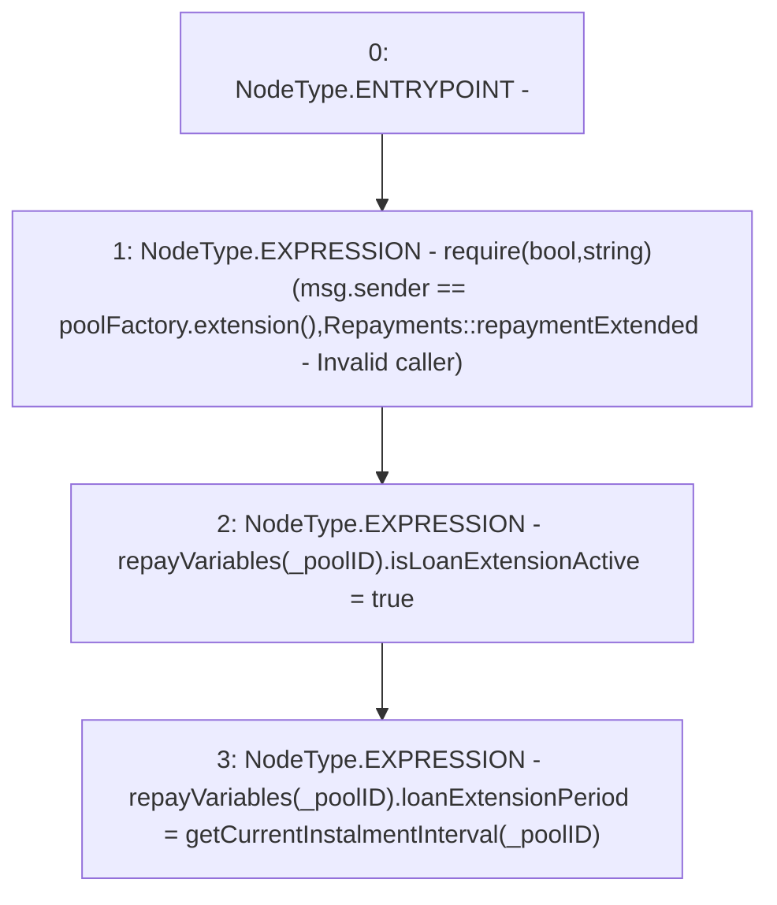

# Context: Repayments.instalmentDeadlineExtended

**Contract:** `Repayments` (Inherits: ReentrancyGuard, IRepayment, Initializable)
**Signature:** `instalmentDeadlineExtended(address)`
**Method Selector ID:** `0x9ccb9fb2`
**Visibility:** `external`
**Environment-Free:** `No (reads EVM state context)`
**Modifiers:** None

### State Variables Interaction
- **Reads:** poolFactory, repayVariables
- **Writes:** repayVariables

### Assertion Checks & Business Requirements
- require/assert: `require(bool,string)(msg.sender == poolFactory.extension(),Repayments::repaymentExtended - Invalid caller)`

### Environment & Verification Flags
- **Uses Foundry Cheatcodes:** No
- **Has Echidna Properties:** No

### Internal Calls Tree
- None

### External Calls / Value Transfers
- `IPoolFactory.TMP_2316(address) = HIGH_LEVEL_CALL, dest:poolFactory(IPoolFactory), function:extension, arguments:[]  `

### Control Flow Graph (CFG)


### Source Mapping
Declared in: `contracts/Pool/Repayments.sol` on lines **436** to **441**

```solidity
    function instalmentDeadlineExtended(address _poolID) external override {
        require(msg.sender == poolFactory.extension(), 'Repayments::repaymentExtended - Invalid caller');

        repayVariables[_poolID].isLoanExtensionActive = true;
        repayVariables[_poolID].loanExtensionPeriod = getCurrentInstalmentInterval(_poolID);
    }

```
