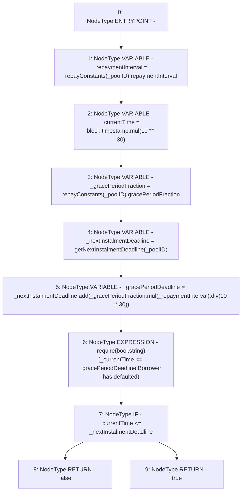

# Context: Repayments.isGracePenaltyApplicable

**Contract:** `Repayments` (Inherits: ReentrancyGuard, IRepayment, Initializable)
**Signature:** `isGracePenaltyApplicable(address) returns (bool)`
**Method Selector ID:** `0xd2144951`
**Visibility:** `public`
**Environment-Free:** `No (reads EVM state context)`
**Modifiers:** None

### State Variables Interaction
- **Reads:** repayConstants
- **Writes:** None

### Assertion Checks & Business Requirements
- require/assert: `require(bool,string)(_currentTime <= _gracePeriodDeadline,Borrower has defaulted)`

### Environment & Verification Flags
- **Uses Foundry Cheatcodes:** No
- **Has Echidna Properties:** No

### Internal Calls Tree
- None

### External Calls / Value Transfers
- `SafeMath.TMP_2222(uint256) = LIBRARY_CALL, dest:SafeMath, function:SafeMath.mul(uint256,uint256), arguments:['_gracePeriodFraction', '_repaymentInterval'] `
- `SafeMath.TMP_2220(uint256) = LIBRARY_CALL, dest:SafeMath, function:SafeMath.mul(uint256,uint256), arguments:['block.timestamp', 'TMP_2219'] `
- `SafeMath.TMP_2224(uint256) = LIBRARY_CALL, dest:SafeMath, function:SafeMath.div(uint256,uint256), arguments:['TMP_2222', 'TMP_2223'] `
- `SafeMath.TMP_2225(uint256) = LIBRARY_CALL, dest:SafeMath, function:SafeMath.add(uint256,uint256), arguments:['_nextInstalmentDeadline', 'TMP_2224'] `

### Control Flow Graph (CFG)


### Source Mapping
Declared in: `contracts/Pool/Repayments.sol` on lines **256** to **267**

```solidity
    function isGracePenaltyApplicable(address _poolID) public view returns (bool) {
        uint256 _repaymentInterval = repayConstants[_poolID].repaymentInterval;
        uint256 _currentTime = block.timestamp.mul(10**30);
        uint256 _gracePeriodFraction = repayConstants[_poolID].gracePeriodFraction;
        uint256 _nextInstalmentDeadline = getNextInstalmentDeadline(_poolID);
        uint256 _gracePeriodDeadline = _nextInstalmentDeadline.add(_gracePeriodFraction.mul(_repaymentInterval).div(10**30));

        require(_currentTime <= _gracePeriodDeadline, 'Borrower has defaulted');

        if (_currentTime <= _nextInstalmentDeadline) return false;
        else return true;
    }

```
