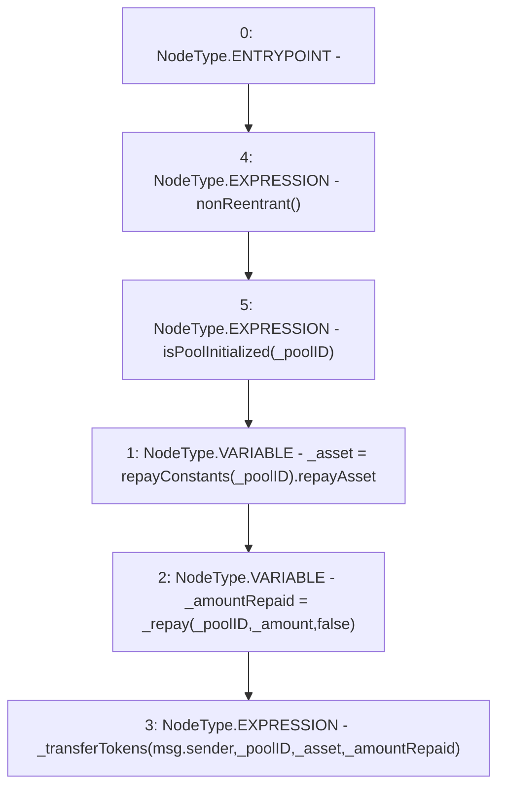

# Context: Repayments.repay

**Contract:** `Repayments` (Inherits: ReentrancyGuard, IRepayment, Initializable)
**Signature:** `repay(address,uint256)`
**Method Selector ID:** `0x22867d78`
**Visibility:** `external`
**Environment-Free:** `No (reads EVM state context)`
**Modifiers:**
- `nonReentrant`
  ```solidity
  modifier nonReentrant() {
          // On the first call to nonReentrant, _notEntered will be true
          require(_status != _ENTERED, "ReentrancyGuard: reentrant call");
  
          // Any calls to nonReentrant after this point will fail
          _status = _ENTERED;
  
          _;
  
          // By storing the original value once again, a refund is triggered (see
          // https://eips.ethereum.org/EIPS/eip-2200)
          _status = _NOT_ENTERED;
      }
  ```
- `isPoolInitialized`
  ```solidity
  modifier isPoolInitialized(address _poolID) {
          require(repayConstants[_poolID].numberOfTotalRepayments != 0, 'Pool is not Initiliazed');
          _;
      }
  ```

### State Variables Interaction
- **Reads:** repayConstants
- **Writes:** None

### Environment & Verification Flags
- **Uses Foundry Cheatcodes:** No
- **Has Echidna Properties:** No

### Internal Calls Tree
- None

### External Calls / Value Transfers
- None

### Control Flow Graph (CFG)


### Source Mapping
Declared in: `contracts/Pool/Repayments.sol` on lines **317** to **322**

```solidity
    function repay(address _poolID, uint256 _amount) external payable nonReentrant isPoolInitialized(_poolID) {
        address _asset = repayConstants[_poolID].repayAsset;
        uint256 _amountRepaid = _repay(_poolID, _amount, false);

        _transferTokens(msg.sender, _poolID, _asset, _amountRepaid);
    }

```
