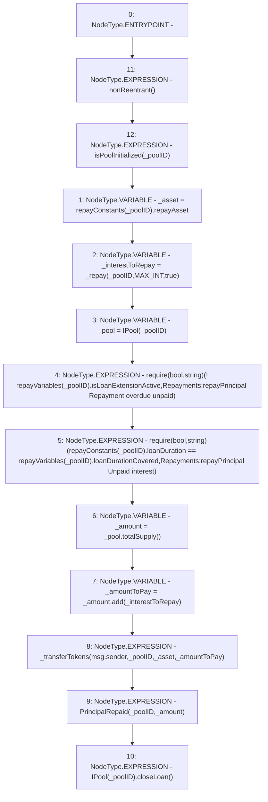

# Context: Repayments.repayPrincipal

**Contract:** `Repayments` (Inherits: ReentrancyGuard, IRepayment, Initializable)
**Signature:** `repayPrincipal(address)`
**Method Selector ID:** `0x040ca2eb`
**Visibility:** `external`
**Environment-Free:** `No (reads EVM state context)`
**Modifiers:**
- `nonReentrant`
  ```solidity
  modifier nonReentrant() {
          // On the first call to nonReentrant, _notEntered will be true
          require(_status != _ENTERED, "ReentrancyGuard: reentrant call");
  
          // Any calls to nonReentrant after this point will fail
          _status = _ENTERED;
  
          _;
  
          // By storing the original value once again, a refund is triggered (see
          // https://eips.ethereum.org/EIPS/eip-2200)
          _status = _NOT_ENTERED;
      }
  ```
- `isPoolInitialized`
  ```solidity
  modifier isPoolInitialized(address _poolID) {
          require(repayConstants[_poolID].numberOfTotalRepayments != 0, 'Pool is not Initiliazed');
          _;
      }
  ```

### State Variables Interaction
- **Reads:** MAX_INT, repayConstants, repayVariables
- **Writes:** None

### Assertion Checks & Business Requirements
- require/assert: `require(bool,string)(! repayVariables[_poolID].isLoanExtensionActive,Repayments:repayPrincipal Repayment overdue unpaid)`
- require/assert: `require(bool,string)(repayConstants[_poolID].loanDuration == repayVariables[_poolID].loanDurationCovered,Repayments:repayPrincipal Unpaid interest)`

### Environment & Verification Flags
- **Uses Foundry Cheatcodes:** No
- **Has Echidna Properties:** No

### Internal Calls Tree
- None

### External Calls / Value Transfers
- `IPool.TMP_2308(uint256) = HIGH_LEVEL_CALL, dest:_pool(IPool), function:totalSupply, arguments:[]  `
- `SafeMath.TMP_2309(uint256) = LIBRARY_CALL, dest:SafeMath, function:SafeMath.add(uint256,uint256), arguments:['_amount', '_interestToRepay'] `
- `IPool.HIGH_LEVEL_CALL, dest:TMP_2312(IPool), function:closeLoan, arguments:[]  `

### Control Flow Graph (CFG)


### Source Mapping
Declared in: `contracts/Pool/Repayments.sol` on lines **407** to **425**

```solidity
    function repayPrincipal(address payable _poolID) external payable nonReentrant isPoolInitialized(_poolID) {
        address _asset = repayConstants[_poolID].repayAsset;
        uint256 _interestToRepay = _repay(_poolID, MAX_INT, true);
        IPool _pool = IPool(_poolID);

        require(!repayVariables[_poolID].isLoanExtensionActive, 'Repayments:repayPrincipal Repayment overdue unpaid');

        require(
            repayConstants[_poolID].loanDuration == repayVariables[_poolID].loanDurationCovered,
            'Repayments:repayPrincipal Unpaid interest'
        );

        uint256 _amount = _pool.totalSupply();
        uint256 _amountToPay = _amount.add(_interestToRepay);
        _transferTokens(msg.sender, _poolID, _asset, _amountToPay);
        emit PrincipalRepaid(_poolID, _amount);

        IPool(_poolID).closeLoan();
    }

```
