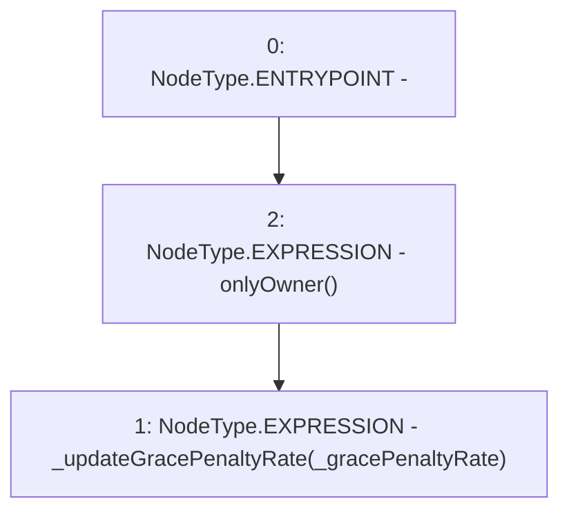

# Context: Repayments.updateGracePenaltyRate

**Contract:** `Repayments` (Inherits: ReentrancyGuard, IRepayment, Initializable)
**Signature:** `updateGracePenaltyRate(uint256)`
**Method Selector ID:** `0x533b2723`
**Visibility:** `external`
**Environment-Free:** `No (reads EVM state context)`
**Modifiers:**
- `onlyOwner`
  ```solidity
  modifier onlyOwner() {
          require(msg.sender == poolFactory.owner(), 'Not owner');
          _;
      }
  ```

### State Variables Interaction
- **Reads:** None
- **Writes:** None

### Environment & Verification Flags
- **Uses Foundry Cheatcodes:** No
- **Has Echidna Properties:** No

### Internal Calls Tree
- None

### External Calls / Value Transfers
- None

### Control Flow Graph (CFG)


### Source Mapping
Declared in: `contracts/Pool/Repayments.sol` on lines **138** to **140**

```solidity
    function updateGracePenaltyRate(uint256 _gracePenaltyRate) external onlyOwner {
        _updateGracePenaltyRate(_gracePenaltyRate);
    }

```
