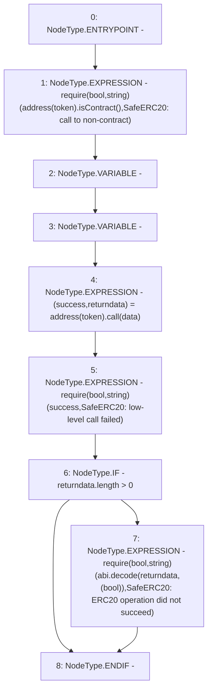

# Context: SafeERC20.callOptionalReturn

**Contract:** `SafeERC20` (Inherits: None)
**Signature:** `callOptionalReturn(ERC20,bytes)`
**Method Selector ID:** `Internal (No Method ID)`
**Visibility:** `private`
**Environment-Free:** `Yes`
**Modifiers:** None

### State Variables Interaction
- **Reads:** None
- **Writes:** None

### Assertion Checks & Business Requirements
- require/assert: `require(bool,string)(address(token).isContract(),SafeERC20: call to non-contract)`
- require/assert: `require(bool,string)(success,SafeERC20: low-level call failed)`
- require/assert: `require(bool,string)(abi.decode(returndata,(bool)),SafeERC20: ERC20 operation did not succeed)`

### Environment & Verification Flags
- **Uses Foundry Cheatcodes:** No
- **Has Echidna Properties:** No

### Internal Calls Tree
- None

### External Calls / Value Transfers
- `Address.TMP_3238(bool) = LIBRARY_CALL, dest:Address, function:Address.isContract(address), arguments:['TMP_3237'] `
- `low-level-call`

### Control Flow Graph (CFG)


### Source Mapping
Declared in: `contracts/mocks/yVault/yVault.sol` on lines **191** to **203**

```solidity
    function callOptionalReturn(ERC20 token, bytes memory data) private {
        require(address(token).isContract(), 'SafeERC20: call to non-contract');

        // solhint-disable-next-line avoid-low-level-calls
        (bool success, bytes memory returndata) = address(token).call(data);
        require(success, 'SafeERC20: low-level call failed');

        if (returndata.length > 0) {
            // Return data is optional
            // solhint-disable-next-line max-line-length
            require(abi.decode(returndata, (bool)), 'SafeERC20: ERC20 operation did not succeed');
        }
    }

```
