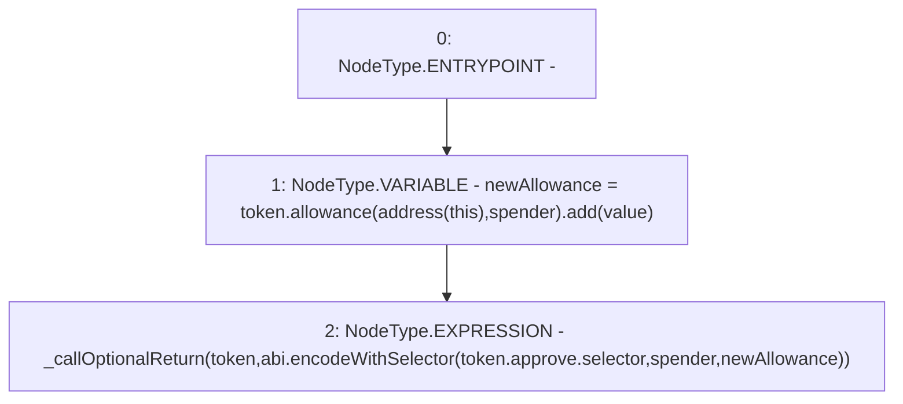

# Context: SafeERC20.safeIncreaseAllowance

**Contract:** `SafeERC20` (Inherits: None)
**Signature:** `safeIncreaseAllowance(IERC20,address,uint256)`
**Method Selector ID:** `Internal (No Method ID)`
**Visibility:** `internal`
**Environment-Free:** `Yes`
**Modifiers:** None

### State Variables Interaction
- **Reads:** None
- **Writes:** None

### Environment & Verification Flags
- **Uses Foundry Cheatcodes:** No
- **Has Echidna Properties:** No

### Internal Calls Tree
- None

### External Calls / Value Transfers
- `SafeMath.TMP_560(uint256) = LIBRARY_CALL, dest:SafeMath, function:SafeMath.add(uint256,uint256), arguments:['TMP_559', 'value'] `
- `IERC20.TMP_559(uint256) = HIGH_LEVEL_CALL, dest:token(IERC20), function:allowance, arguments:['TMP_558', 'spender']  `

### Control Flow Graph (CFG)


### Source Mapping
Declared in: `node_modules/@openzeppelin/contracts/token/ERC20/SafeERC20.sol` on lines **48** to **51**

```solidity
    function safeIncreaseAllowance(IERC20 token, address spender, uint256 value) internal {
        uint256 newAllowance = token.allowance(address(this), spender).add(value);
        _callOptionalReturn(token, abi.encodeWithSelector(token.approve.selector, spender, newAllowance));
    }

```
