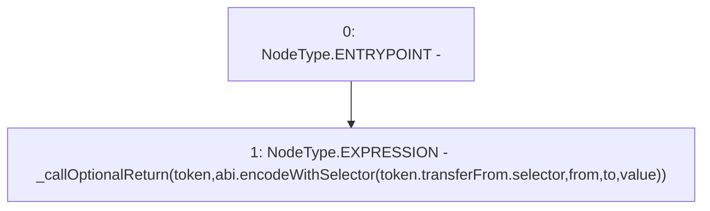

# Context: SafeERC20.safeTransferFrom

**Contract:** `SafeERC20` (Inherits: None)
**Signature:** `safeTransferFrom(IERC20,address,address,uint256)`
**Method Selector ID:** `Internal (No Method ID)`
**Visibility:** `internal`
**Environment-Free:** `Yes`
**Modifiers:** None

### State Variables Interaction
- **Reads:** None
- **Writes:** None

### Environment & Verification Flags
- **Uses Foundry Cheatcodes:** No
- **Has Echidna Properties:** No

### Internal Calls Tree
- None

### External Calls / Value Transfers
- None

### Control Flow Graph (CFG)


### Source Mapping
Declared in: `node_modules/@openzeppelin/contracts/token/ERC20/SafeERC20.sol` on lines **26** to **28**

```solidity
    function safeTransferFrom(IERC20 token, address from, address to, uint256 value) internal {
        _callOptionalReturn(token, abi.encodeWithSelector(token.transferFrom.selector, from, to, value));
    }

```
