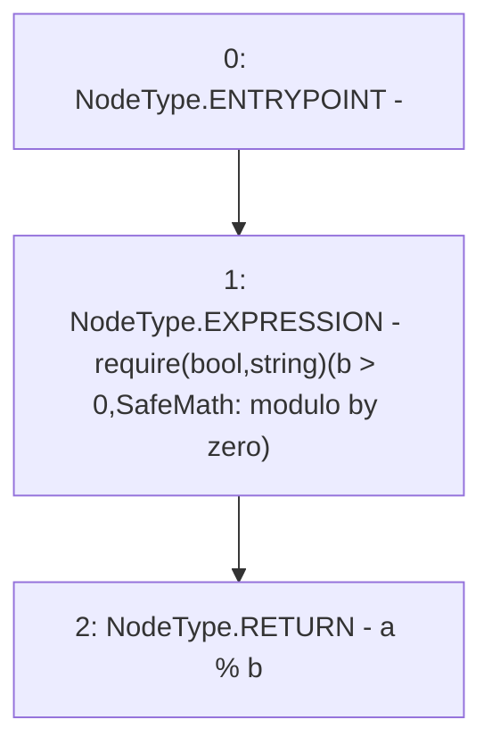

# Context: SafeMath.mod

**Contract:** `SafeMath` (Inherits: None)
**Signature:** `mod(uint256,uint256) returns (uint256)`
**Method Selector ID:** `Internal (No Method ID)`
**Visibility:** `internal`
**Environment-Free:** `Yes`
**Modifiers:** None

### State Variables Interaction
- **Reads:** None
- **Writes:** None

### Assertion Checks & Business Requirements
- require/assert: `require(bool,string)(b > 0,SafeMath: modulo by zero)`

### Environment & Verification Flags
- **Uses Foundry Cheatcodes:** No
- **Has Echidna Properties:** No

### Internal Calls Tree
- None

### External Calls / Value Transfers
- None

### Control Flow Graph (CFG)


### Source Mapping
Declared in: `node_modules/@openzeppelin/contracts/math/SafeMath.sol` on lines **152** to **155**

```solidity
    function mod(uint256 a, uint256 b) internal pure returns (uint256) {
        require(b > 0, "SafeMath: modulo by zero");
        return a % b;
    }

```
