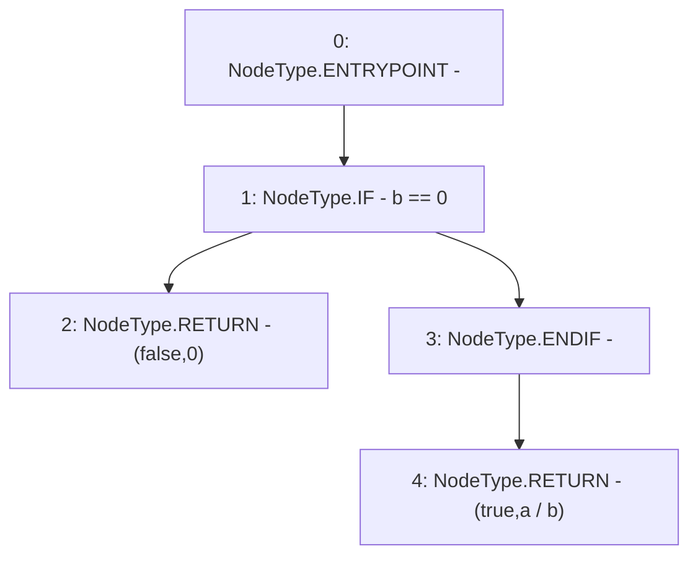

# Context: SafeMath.tryDiv

**Contract:** `SafeMath` (Inherits: None)
**Signature:** `tryDiv(uint256,uint256) returns (bool, uint256)`
**Method Selector ID:** `Internal (No Method ID)`
**Visibility:** `internal`
**Environment-Free:** `Yes`
**Modifiers:** None

### State Variables Interaction
- **Reads:** None
- **Writes:** None

### Environment & Verification Flags
- **Uses Foundry Cheatcodes:** No
- **Has Echidna Properties:** No

### Internal Calls Tree
- None

### External Calls / Value Transfers
- None

### Control Flow Graph (CFG)


### Source Mapping
Declared in: `node_modules/@openzeppelin/contracts/math/SafeMath.sol` on lines **60** to **63**

```solidity
    function tryDiv(uint256 a, uint256 b) internal pure returns (bool, uint256) {
        if (b == 0) return (false, 0);
        return (true, a / b);
    }

```
