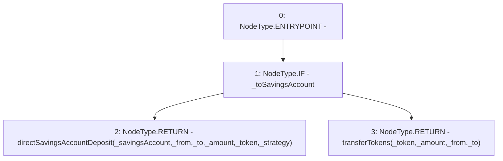

# Context: SavingsAccountUtil.directDeposit

**Contract:** `SavingsAccountUtil` (Inherits: None)
**Signature:** `directDeposit(ISavingsAccount,address,address,uint256,address,bool,address) returns (uint256)`
**Method Selector ID:** `Internal (No Method ID)`
**Visibility:** `internal`
**Environment-Free:** `No (reads EVM state context)`
**Modifiers:** None

### State Variables Interaction
- **Reads:** None
- **Writes:** None

### Environment & Verification Flags
- **Uses Foundry Cheatcodes:** No
- **Has Echidna Properties:** No

### Internal Calls Tree
- None

### External Calls / Value Transfers
- None

### Control Flow Graph (CFG)


### Source Mapping
Declared in: `contracts/SavingsAccount/SavingsAccountUtil.sol` on lines **28** to **42**

```solidity
    function directDeposit(
        ISavingsAccount _savingsAccount,
        address _from,
        address _to,
        uint256 _amount,
        address _token,
        bool _toSavingsAccount,
        address _strategy
    ) internal returns (uint256) {
        if (_toSavingsAccount) {
            return directSavingsAccountDeposit(_savingsAccount, _from, _to, _amount, _token, _strategy);
        } else {
            return transferTokens(_token, _amount, _from, _to);
        }
    }

```
